####(0506)有关mac
zsh详细配置过程见[终极 Shell——ZSH](http://zhuanlan.zhihu.com/mactalk/19556676)    
brew安装过程见[Mac OS X 中安装 brew](http://webmedia.blog.163.com/blog/static/416695020123261226695/)  
cmd+shift+3 截全屏  
cmd+shift+4 截任意范围屏  
cmd+shift+4+space 捕获某个应用程序的窗口  
fn+delete  从光标往后删除  
cmd+shift+f  全屏/退出全屏  
cmd+w 关闭窗口  
cmd+q 退出程序  

####修改鼠标移动速度，需要更新数据库才能起作用及需要恢复出厂设置一下
packages/SettingsProvider/res/values/defaults.xml
    
/data/data/com.android.providers.settings/databases
select * from system;
update system set value='-2' where name='pointer_speed';

####VirtualBox Host-Only Network 导致虚拟机ping不通网关
装genymotion时候装了virtualbox，在网络和共享中心可以看到VirtualBox Host-Only Network，在虚拟机中ping网关都不通，显示icmp_seq=2 Destination Host Unreachable。将virtualbox那个禁用就ok了，WTF!

####删除路由
sudo route del -net link-local netmask 255.255.0.0  
sudo route del -net 172.16.6.0 netmask 255.255.255.0

####新接口
int faccessat(int dirfd, const char *pathname, int mode, int flags);  // 查看文件pathname 是否在目录diffd中  
配合int dirfd = open(dir, O_DIRECTORY); 使用

####模拟的内置sdcard分区
不再单独划分sdcard分区，占用flash空间，利用率低。将其合并到data分区中。
sdcard -u 1023 -g 1023 -l /data/media /mnt/shell/emulated ，使用fuse机制，创建挂载点，其内容最终放在/data/media目录。  
mount 信息：/dev/fuse /mnt/shell/emulated fuse rw,nosuid,nodev,relatime,user_id=1023,group_id=1023,default_permissions,allow_other 0 0  
此外创建一些链接，供不同应用使用内置sdcard。  
/storage/emulated/0 ->/mnt/shell/emulated/0  
/mnt/sdcard -> /storage/emulated/0  
/sdcard -> /mnt/sdcard

####(0316)有关source环境变量报错找不到文件：-sh: source: bcm7584.env: file not found
虽然/bin/sh 已经是指向/bin/bash，但修改/etc/password 中sunhuasheng:x:1022:1022::/home/sunhuasheng:/bin/bash 即可

####(0316)有关@SuppressWarnings
@SuppressWarnings(“”)  
@SuppressWarnings({})  
@SuppressWarnings(value={})  
用于在编译时忽略特定警告  
@SuppressWarnings("deprecation")表示不显示使用了不赞成使用的类或方法时的警告  
@SuppressWarnings("unchecked", "deprecation")   
@SuppressWarnings(value={"unchecked", "deprecation"})   

####键值上抛及待机流程
相关代码：  
policy/src/com/android/internal/policy/impl/PhoneWindowManager.java  
services/input/EventHub.cpp  
services/input/InputDispatcher.cpp  
services/input/InputReader.cpp  
services/java/com/android/server/power/PowerManagerService.java  
services/jni/com_android_server_input_InputManagerService.cpp  
有关inotify：  
[linux 监视文件系统inotify 测试](http://blog.csdn.net/hepeng597/article/details/7792565)  
流程：  
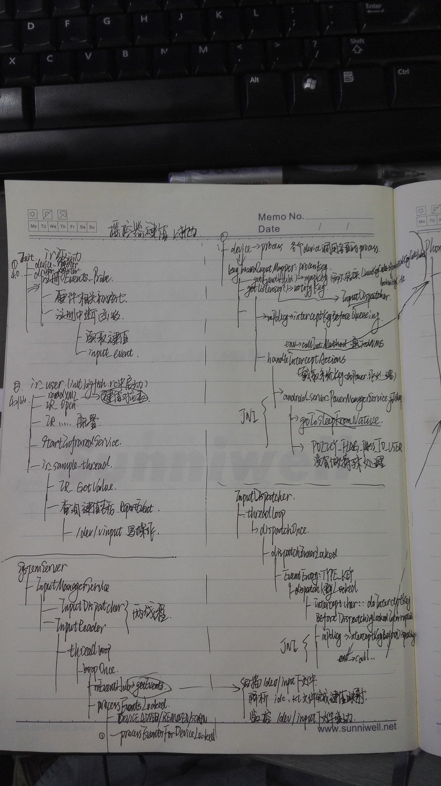    
    

####(0313) 有关按键音
音频文件位置：/system/media/audio/ui/，可直接替换   
接蓝牙音箱会有杂音。小米盒子、手机接蓝牙音箱按键音也会有同样现象。分析来看在蓝牙音箱接到播放信息后启动声音输出的和关闭声音输出的瞬间会有杂音，在按键音这种持续时间特别短的情况下就会比较明显的感觉到杂音的存在。  

####(0310)Linux下运行windows软件的工具
wine

####（0306）data分区剩余空间检测问题
    

####（0306）/data/property/xx权限问题
/data/property/xx 需要600权限才能生效  
git中上传0600权限的文件，下载下来的是0644  
target.zip中0600的文件，打出来的升级包中文件权限也会变回0644  
需要改权限的需要在升级脚本updater-script中升级到盒子上之后再修改  
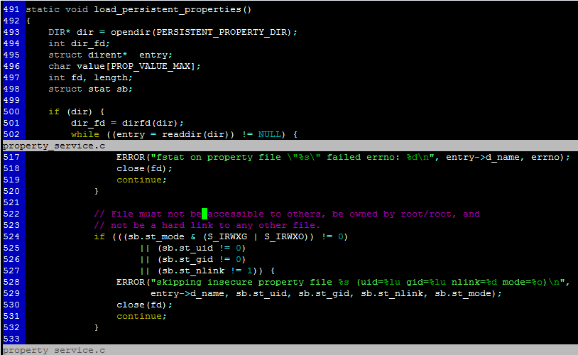    

####(0213)有关修改分区
1. swptable.c 中填写分区信息，在partition分区没有数据或者数据异常导致校验不过的时候会将默认分区信息回写到partition分区中。由于存在partition的回写功能，开始调试时候可能出现更换了fastboot但没有按新分区信息设置bootargs，那就需要手动破坏一下partition。比如partition是这样的话“1         partition    0x000200000     0x000200000”，开机上电ctrl+c进入fastboot，执行 mmc write 0 1ffffc0 1000 1000 来破坏partition分区。  
    代码：device/hisilicon/bigfish/sdk/source/boot/product/android
2. BoardConfig.mk，这里有编译sdk时候打镜像的大小，目前我们有了小系统这一机制，版本的镜像都是用小系统打出来的，此文件可以不修改。  
    代码路径：device/hisilicon/Hi3798MV100，留意330的文件是BoardConfig_8M330.mk
3. Hi3798MV100-emmc.xml ，分区表文件，一套sdk可能在不同项目上分区信息不一样，这个文件可以不修改，但需要上传小系统platform/on-project/pub/image/  
    代码路径：device/hisilicon/Hi3798MV100/prebuilts
4. recovery.emmc.fstab ，这里有分区名称及顺序，不像android4.0一样还有分区大小，如果只改动了分区的大小，此文件可以不修改。  
    代码路径：bootable/recovery/etc
5. 小系统中partinfo.conf，编译各个分区的镜像及生产镜像时候都是从这个文件里边读取分区大小。  
    代码路径：platform/on-project/pub/swproduct/partinfo.conf
6. fastboot需要编译三个出来：  
	* 正常编译出来的fastboot.bin 对应小系统platform/on-project/pub/image/loader.bin  
	* 将build/swfastbootenv/fastboot-8M330-D2048-E4096.env中SW_FORCE_OPEN_CONSOLE 打开（记得重新source环境变量），编译fastboot，此fastboot可以强制打开串口、将adb连接的用户设置为root，此fastboot用于在user版本上开发调试使用，对应platform/on-project/pub/image/loader_ForceOpenConsole.bin  
	* 关掉SW_FORCE_OPEN_CONSOLE 开关，打开SW_CLOSE_LOADER_KEYED开关（记得重新source环境变量），编译一个禁掉ctrl+c功能的fastboot.bin 用于user版本，对应platform/on-project/pub/image/loader_user.bin  
7. 验证工作  
	* Hitool烧写小系统中编译出来的镜像，看各个分区是否都挂载正常  
	* 升级小系统编译出来的升级包，看升级是否正常  
	* 用3798_update_product_sign.zip 升级生产镜像，看升级完后能否正常启机，看各个分区是否挂载正常，是否出现要求产测的蓝色界面。  

  
####(0210)有关data分区剩余空间检测问题
实现方案：1. 提供apk，动态检测data分区剩余空间，少于阈值50M时候弹框提示用户，并提供清理按钮，可清理掉一些缓存等文件释放空间。如果在清理之前出现data空间剩余过少或者升级后在data新生成文件导致剩余空间过少以至于影响系统上电启动，这个时候rootservice中会在启动之时创建一线程检测launcher是否已起来，如果两分钟内没有检测到launcher或者launcher的pid变化三次及以上，则显示一个提示页面告之用户设备异常正在修复，等五秒后将data分区格式化然后重启。  
    目前一个apk加rootservice的方案能够满足处理data分区剩余空间不足的问题，此外，swRootService检测launcher的方案还能处理像数据损坏导致启动异常的情况。  
方案2. 同样提供apk用户检测data分区剩余空间，此外在init启动时候也检测data分区剩余空间情况，小于阈值则去删除部分目录内容，这里包括/data/app/,/data/data/,/data/dalvik-cache。此方案功能略逊色于swRootservice，不过如果没有swRootservice也不失为一种好方法。  
其中init中检测打他分区空间状况的代码：  
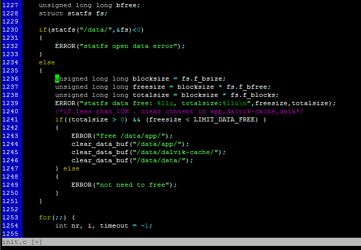    
  

####(0209)版本控制流程梳理：
评审、研发自测试、转版本发布、基线问题单管理  
**评审环节：**  
1、发布评审时需要通知到 "平台项目负责人"+"模块组组长"，并且两人全部"+1 Looks good to me, but someone else must approve”后，自己选择 "+2 Looks good to me, approved"，并选择 "Publish and Submit" 上传代码。  
2、评审时间需要在发布评审后，两个工作日内必须完成整个评审的过程。 这个过程的责任人为评审发布人。  
3、紧急情况下可以先自己完成评审，并必须要同时发布紧急邮件评审通知，通知到各个负责人。注意要必须通知。  
4、Git log说明要清晰易懂。  
5、在各个模块负责人修改问题上传代码时同步上传并评审ReleaseNotes.txt，请各个评审人注意看是否有上传ReleaseNotes.txt文件，如发现没有请拒绝评审。  
**研发自测试：**  
1、代码提交后自己操作CI完成大系统编译。  
2、完成编译后完成研发自测试，确保编译后的文件解决了相关问题。  
3、为了确保研发基线发布的有效性，请大家务必重视研发自测试环节。会在基线测试时评估问题回归的有效性。  
**转版本发布：**  
1、当前基线版本每两周转一个版本。暂定于周五上午研发内部发布。  
2、研发自测试后周一转测试部。  
**转版本发布交付件：**  
1、Release Note  
2、朝歌Android机顶盒基线特性列表    
**Release Note格式如最后**
**基线问题单管理：**  
1、每两周过一次基线问题单，会同步要求基线发布版本上要解决哪些问题，要合入哪些问题。  
2、基线问题单的解决效率。要在每一个版本上确定要解决掉哪些问题，在发布版本时也要确保已经解决这些问题。  
**奖惩制度的建立，几个关键点：**  
1、评审环节不允许自己评审自己(除了发紧急邮件通知外)，是否符合要求，需要人定期检查。  
2、确保自测试，未回归通过问题的回溯。  
3、基线问题单的解决率。  
**Release Notes:**  
文件介绍：此文件记录大系统所有的修改；
最新的修改填写到Version版本号最高的一栏中，比如有V1.1和V1.0，就要填到V1.1中的最后部分；
问题的前面的序列号为累加的数字；
/* 模板 */
序列号. 修改问题的简要描述
责任人: （自己的姓名）
修改描述: （填写详细描述）
修改文件: （修改的源文件）
更新的库或可执行文件:
影响范围:
测试建议:
  

####(0121)3798M单板待机调试
1、直接在串口上配置himm 0xf80000bc 0x80510001，看是否能进入待机（不会有suspend的打印，可以量一下电压有没有），是否能唤醒；  
2、在串口上配置himm 0xf840e520 0x11111111，同样看看是否可以进入待机，是否能唤醒 
提供的朝歌的镜像烧写到demo1a的高安单板上，发现同样无法唤醒。进一步定位发现，android系统启动后，c51里的代码全部被擦除了：   
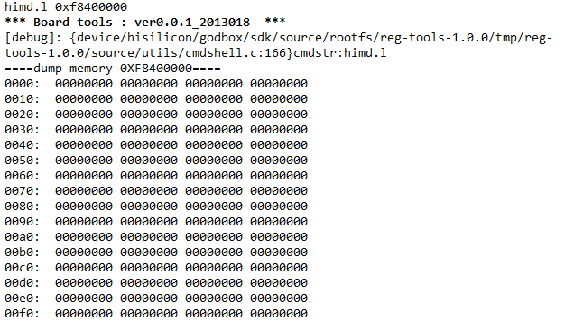  
而在boot下，c51的数据是存在的：  
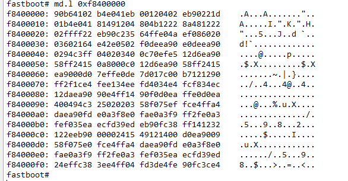  

####(0117)有关北通阿修罗se BTP-2175手柄无响应问题
使用另外一款罗技的手柄可以使用，网上搜索该手柄驱动支持方面的情况。发现其实是工作模式的问题。该品牌手柄又pc模式和android模式，按照网上搜到的说明切换到android模式，专用语BFM模式。具体操作见[BFM模式介绍](http://www.betop-cn.com/html/related/zuixinzixun/2014/0108/2121.html)  

####(1231)有关sizeof(更多详情见 [sizeof，终极无惑（上）](http://blog.csdn.net/freefalcon/article/details/54839))
编译器的pack指令，它是用来调整结构体对齐方式的，不同编译器名称和用法略有不同，VC6中通过`#pragma pack`实现，也可以直接修改/Zp编译开关。#pragma pack的基本用法为：`#pragma pack( n )`，n为字节对齐数，其取值为1、2、4、8、16，默认是8，如果这个值比结构体成员的sizeof值小，那么该成员的偏移量应该以此值为准，即是说，结构体成员的偏移量应该取二者的最小值，公式如下：
offsetof( item ) = min( n, sizeof( item ) )
再看示例：

    #pragma pack(push) // 将当前pack设置压栈保存
    #pragma pack(2) // 必须在结构体定义之前使用
    struct S1
    {
    char c;
    int i;
    };
    struct S3
    {
    char c1;
    S1 s;
    char c2
    };
    #pragma pack(pop) // 恢复先前的pack设置
       
计算sizeof(S1)时，min(2, sizeof(i))的值为2，所以i的偏移量为2，加上sizeof(i)等于6，能够被2整除，所以整个S1的大小为6。  
同样，对于sizeof(S3)，s的偏移量为2，c2的偏移量为8，加上sizeof(c2)等于9，不能被2整除，添加一个填充字节，所以sizeof(S3)等于10。  
还有一点要注意，**“空结构体”（不含数据成员）的大小不为0，而是1**。试想一个“不占空间”的变量如何被取地址、两个不同的“空结构体”变量又如何得以区分呢？于是，“空结构体”变量也得被存储，这样编译器也就只能为其分配一个字节的空间用于占位了。如下：  

    struct S5 { };
    sizeof( S5 ); // 结果为1

  

####(1214)python 自动补全
python可以Tab键补全，可以在启动python后，执行下
import readline, rlcompleter; readline.parse_and_bind("tab: complete")
这就可以按 Tab 键补全了。  
python 如果嫌每次都要键入这东西麻烦的话，可以把上边这行写到 ~/.pythonstartup.py ，在 ~/.bashrc 里加一个环境变量
export PYTHONSTARTUP=~/.pythonstartup.py
这就会每次启动 python 都先执行了

####(1126)有关data分区概率性变成只读问题
目前在测试过程中出现一台盒子data分区变成ro(目前使用的ext4文件系统格式化策略是出现冲突等异常后,只读挂载分区,用于保护用户数据)。这个问题在反复上下电的情况下,比较容易出现  
讨论后处理方法:  
1.在后台卸载userdata分区,使用e2fsck进行修复,再重新挂载.但是userdata卸载以后,launcher/ 虚拟机等进程会出现异常   
2.每次开机后都对userdata进行检查并修复  
选用第二种方法，并且在修复后仍然挂载不上的情况将data分区格式化掉。  
    
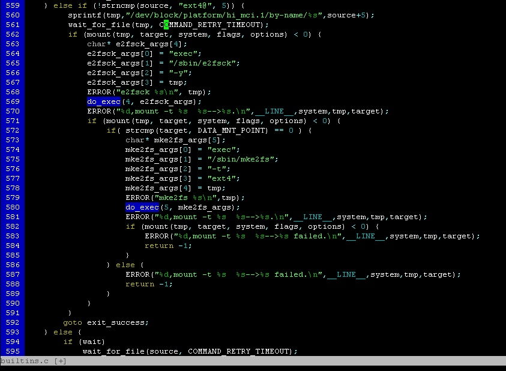    

####(1105)利用KSM机制优化内存
KSM全称为 Kernel Shared Memory 或 Kernel Samepage Merging，KSM作为Linux内核中的守护进程（称为ksmd）存在，它定期执行页面扫描，识别副本页面并合并副本，释放这些页面以供它用。  
    
补充阅读见：[KSM(Kernel Samepage Merging) 剖析：Linux 内核中的内存去耦合](http://blog.csdn.net/summer_liuwei/article/details/6013255)  
[pmem and cma](http://blog.csdn.net/ryder001/article/details/7794515)  

####添加遥控器键值
1. frameworks/base/core/java/android/view/KeyEvent.java 添加KEYCODE  
`     public static final int KEYCODE_MYAPP           = 1192;`
2. frameworks/base/core/res/res/values/attrs.xml 添加KEYCODE  
`	<enum name="KEYCODE_MYAPP"  value="1192" />`
3. frameworks/base/data/keyboards/Generic.kl 添加LinuxCode  
`	key 157   MYAPP`
4. frameworks/native/include/android/keycodes.h  
`    AKEYCODE_MYAPP              = 1192,`
5. frameworks/native/include/input/KeycodeLabels.h  
`    { "MYAPP"        ,1192},`
6. device/hisilicon/bigfish/prebuilts/Vendor_0001_Product_0001.kl  
`    key 157   MYAPP             FUNCTION`

####shell 定义函数问题
shell function不能空，会导致下面的function使用的时候报not found

####有关log（logger驱动、system/core/liblog、system/core/logcat）：
logger驱动将日志信息写到/dev/log/main events radio  system 设备节点中
logcat从中读取  
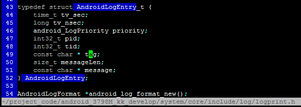  
实用举例：

1. 添加时间：logcat -v time
2. 过滤关系的日志：logcat -s KeyEvent  VPP_DLNA_LOG
3. 剔除部分不关心的日志：logcat KeyEvent:s  VPP_DLNA_LOG:s 
4. 日志导入到文件中：
     1) logcat -f /data/mylog.txt 
     2) logcat -f /data/c.txt -n5 -r3000   //以3000KB大小为限，最多保留5个文件
5. 只显示最近的日志：logcat -t 50

####新接口
	size_t strspn(const char *s, const char *accept); //字符串s 开头连续有n 个字符都是属于字符串accept内的字符
	size_t strcspn(const char *s, const char * reject);//字符串s 开头连续有n 个字符都不含字符串reject 内的字符

####Android4.4添加键值：
core/res/res/values/attrs.xml 不添加亦可  
include/input/KeycodeLabels.h 实际起作用

####ubuntu 安装wxPython:
	apt-get install python-wxgtk2.8
	sudo apt-get install python-wxgtk2.8 python-wxtools wx2.8-i18n

####Oop后重启功能：
在Android系统下，长时间运行下，尤其是达到1个月以上的用户不会插拔电源的，我们是不能够保证不发生 Oop(Kernel panic)的，但可以做到事情发生之后，能够重启；
添加修改如下；
init.rc
	
	#5s 之后重启
	write /proc/sys/kernel/panic  5
	wirte /proc/sys/kernel/panic_on_oops 1

####查看遥控器键值物理码：
调整日志级别打印物理码：echo HI_IR=4 >/proc/msp/log   
调整日志级别到默认情况：echo HI_IR=1 >/proc/msp/log   

####data数据异常：
200台盒子发现4台盒子异常，有这么两种现象：  
1. 启机失败  
2. 某些应用异常  
其中不能启机的盒子，发现SettingsProvider应用的数据库目录变成了管道文件，如图：  
   
创建管道文件：busybox mknod aa p

####swRootService 中socket频繁创建影响广播导致启动应用慢

####定义可变参数接口int foo( char* msg, ... );
va_start/va_arg/va_end 见测试代码origin_c/va_start_20150123，个人感觉还是需要了解参数类型及个数，要不然函数内部没有办法准确取出来使用，能少敲些代码倒是真的，能偷懒的即是好机制。

####awk中赋值：
eval $(awk '$2=="/mnt/sdcard" {printf("ret=1");}' $FILE)
eval 下执行可以用printf给变量赋值

####(0123)ART 模式与 Dalvik 模式
在Dalvik下，应用每次运行的时候，字节码都需要通过即时编译器转换为机器码，这会拖慢应用的运行效率。在ART 环境中，应用在第一次安装的时候，字节码就会预先编译成机器码，使其成为真正的本地应用。这个过程叫做预编译（AOT,Ahead-Of-Time）。这样的话，应用的启动(首次)和执行都会变得更加快速。

####有关mkbootfs
	${OUT}/build/tool/linux-x86/bin/mkbootfs \
         ${OUT}/${OUT_DIR}/target/${target_name}/BOOT/RAMDISK | \
         ${OUT}/build/tool/linux-x86/bin/minigzip > ${OUT}/${OUT_DIR}/obj/ramdisk_for_boot.img
1. 根据include/private/android_filesystem_config.h 中android_dirs/android_files中预先设计的目录或者文件的mode、uid、gid、capablities（诸如setuid/setgid）配置文件的权限。  
如果新添加目录或者制作新文件系统镜像需要在此配置相应权限。
2. _eject接口中将数据写向了stdout，交由minizip进一步处理成img。
涉及：
`void qsort(void *base, int nelem, int width, int (*fcmp)(const void *,const void *));`  
各参数：1 待排序数组首地址 2 数组中待排序元素数量 3 各元素的占用空间大小 4 指向函数的指针  
其中fcmp可以提供自定义的比较规则。

####有关recovery中shell环境
user版本的busybox 将sh裁减掉的，所以调试时候一种方式是替换完整的busybox，另一种方式则是启动mksh。mksh代码在external/mksh，需要修改Android.mk链接静态libc。  

    service console /sbin/busybox sh
        console

修改为 
 
    service console /sbin/mksh
        console

####参数列表的另一种写法：
	431 int send_probe(seq, ttl)
	432         int seq, ttl;
	433 {

	566 int packet_ok(buf, cc, from, seq)
	567         u_char *buf;
	568         int cc;
	569         struct sockaddr_in *from;
	570         int seq;

####几个硬件问题：
1. flash电容放电慢会导致上下电太快则盒子起不来
2. hdmi 信息都正常，某个盒子在某个电视上无输出，问题是输出信号不太好，更换磁珠解决

####putty作串口工具出现过不能输入情况，换用secreCRT就ok，wtf！

####build.prop 本身的属性会影响属性的解析
属性设置失败：  
-rw-rw-rw- root     root         2909 2014-11-18 18:01 build.prop  
属性设置成功：  
-rw-r--r-- root     root         2909 2014-11-18 18:01 build.prop  

####SecureCRT日志添加时间信息：
C:\Users\huasheng\Documents\%H_%M_%D_%h_%m_%s.log
[%Y/%M/%D %h:%m:%s:%t]  
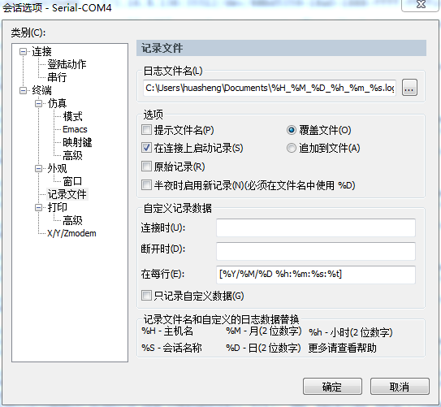  

####有关宏的取非
	#if !defined (SUPPORT_FPGA)
	xxx
	#endif

####有关sem_init
	#include<semaphore.h>
	int sem_init (sem_t *sem, int pshared, unsigned int value);
这个函数的作用是对由sem指定的信号量进行初始化，设置好它的共享选项，并指定一个整数类型的初始值。pshared参数控制着信号量的类型。如果 pshared的值是0，就表示它是当前里程的局部信号量；否则，其它进程就能够共享这个信号量。现在只对不让进程共享的信号量感兴趣。（这个参数受版本影响）， Linux线程目前不支持进程间共享信号量，pshared传递一个非零将会使函数返回ENOSYS错误。

####eclipse格式对齐快捷键ctrl+shift+f失效原因
原因：此热键被hook住了
找了好几个常用软件，最终发现罪魁祸首在搜狗拼音，这个的确是个常用软件啊......容易被忽视的

####msgfmt命令找不到：
执行#sudo apt-get install gettext安装msgfmt；

####终端广播：
	echo "hello" |wall
	wall  <<zzz
	>something to send
	>something more to send
	>zzz

####非root用户打开root权限文件进行保存：
在Linux，没有sudo 就直接用vim 编辑/etc/内的文件，等编辑好了之后，使用vim保存时，得到提示说文件无法保存，这时候才发现没权限。针对这种问题，目前有如下几种解决方案。  
	
	vi /etc/httpd.conf 保存时，用命令:w !sudo tee %
    :w - Write a file.
    !sudo - Call shell sudo command.
    tee - The output of write (vim :w) command is redirected using tee. The % is nothing but current file name i.e. /etc/httpd.conf. In other words tee command is run as root and it takes standard input and write it to a file represented by %. However, this will prompt to reload file again (hit L to load changes in vim itself).
强烈推荐这一种用法。不过，首先得保证运行vim的用户有sudo的权限。

####编译出来的驱动版本号跟kernel不一致导致加载失败：
	修改：linux-3.4.y/scripts/setlocalversion 
	163 if test "$CONFIG_LOCALVERSION_AUTO" = "y"; then
	164     # full scm version string
	165     res="$res$(scm_version)"
	166 else
	167     # append a plus sign if the repository is not in a clean
	168     # annotated or signed tagged state (as git describe only
	169     # looks at signed or annotated tags - git tag -a/-s) and
	170     # LOCALVERSION= is not specified
	171     if test "${LOCALVERSION+set}" != "set"; then
	172         scm=$(scm_version --short)
	173         #res="$res${scm:++}" 注释掉这一行
	174     fi
	175 fi
	176
	177 echo "$res"

####有关HDMI问题定位信息
1. 抓取日志  
从开机上电开始抓取，一直到复现问题。
2. 抓取PROC信息  
在串口系统命令行下运行并保存：
`cat /proc/msp/hdmi;cat /proc/msp/disp1;`
3. 抓取驱动信息：  
	1）先在串口下输入：echo hdmi=3 >/proc/msp/log  
	2）查看是否设置正常，输入：cat /proc/msp/log  
	3）抓取驱动日志：cat /proc/ksmg

####有关IR键值
红外协议：nec simple uPD6121G  
每次按下遥控器一个按键，它将发送一个串信号： 引导码+用户码+用户反码+键码+键码的反码.  
其中引导码是固定波形。用户码（有的称系统码）用来标识遥控器类型一个整数，受控设备一般只接收特定用户码的遥控器控制。一般固化不可以调。但所谓的万能遥控器就是能随意修改自己的用户码设备。  
键码是不同的按键对应不同的值。就是软件主要读它来判断，即用户按下了哪一个键，遥控器的学习相当于读出遥控器的用户码。  

波形受干扰：wifi信号在盒子内经反射以及日光灯照射均会对红外信号造成干扰，表现在波形上就是出现一些低电平的毛刺，优化思路就是将不规则信号保存并相加，拼凑出bit0或者bit1  

协议及键值波形如下图：  
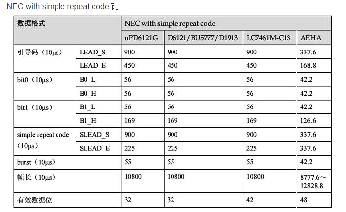  
  

####雅马哈功放配置攻略
一：HDMI接入方式配置  
1.HDMI线接入后面板【HDMI】【IN】（有1/2/3/4/可用）  
2.选择【QUICK SELECT】【1】，此时面板中央显示[DVD]  
>DVD下放的[STEREO] [ROCK ARENA] [JAZZ CLUB].. 表示风格，可通过【SELECT/ENTER】切换，不影响音频输出与否。 
 
3.按【MENU】进入[ Input Setup ]（进入后可用【^】【v】查找）  
>按【SELECT/ENTER】进入[ Assign ]（进入后可用【^】【v】查找）  
按【SELECT/ENTER】进入[ HDMI ]输入配置页面  
旋转【SELECT/ENTER】选择第1步骤中HDMI线接入的接口  
按【SELECT/ENTER】进行确认  
按【MENU】退出配置页面  
  
4.此时已经完成HDMI接入方式的配置  

二：SPDIF 接入方式配置  
1.SPDIF线接入前面板【OPTICAL-3】或者后面板【OPTICAL-1】【OPTICAL-2】  
2.选择【QUICK SELECT】【2】，此时面板中央显示[TV/CBL]  
3.按【MENU】进入[ Input Setup ]（进入后可用【^】【v】查找）  
>按【SELECT/ENTER】进入[ Assign ]（进入后可用【^】【v】查找）  
按【SELECT/ENTER】进入[ HDMI ]输入配置页面，进入后用【^】【v】查找到[Digital]输入配置页面  
旋转【SELECT/ENTER】选择第1步骤中SPDIF线接入的接口[OPT3]或者[OPT1]/[OPT2]  
按【SELECT/ENTER】进行确认  
按【MENU】退出配置页面  

4.此时已经完成SPDIF接入方式的配置  

####查看某个进程内存使用情况：
procmem  one_pid  

####查看进程中具体某个线程占cpu：
top -t -m 5  

####cts，provider项：
run cts -p android.provider  

####logcat抓取日志，剔除某个tag的日志：
logcat |grep -v SettingsProvide  
grep -v 'Copy_Project_Images_Files\|Rm_unnecessary_files' project_priv.sh

####有关adb的root权限
user版本默认adb为shell用户，eng版本为root权限。所以需要关心adb用户的则是在user版本，此时不宜修改ro.debuggable。  
adb.c的main中should_drop_privileges返回true则会成为shell用户，相反则为root权限。用属性实现灵活控制，便于调试：   
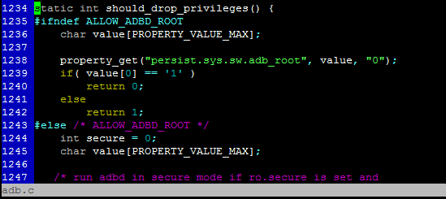  

####安全红线查找权限超规格文件：
1、adb shell  
2、busybox find \( -perm -04000 -o -perm -02000 \) -exec busybox ls -ld {} \; > /data/finds.txt  
3、退出adb，执行adb pull /data/finds.txt d:\finds.txt，检查此txt文件中内容  

####网络部分朝歌自己代码：
ethernet/java/android/net/ethernet/EthernetManager.java  
ethernet/java/android/net/ethernet/EthernetManager.java  
core/java/android/net/EthernetDataTracker.java  

####bootanimation.zip 压缩:
 zip -r -X -Z store ../bootanimation.zip  part*/*.png desc.txt  

####wifi mac:
iwpriv wlan0 efuse_set mac,00076322334a  
iwpriv wlan0 efuse_get mac  

####hisi usb3.0：
关闭usb3.0的方法：在device\hisilicon\bigfish\sdk\source\kernel\linux-3.10.y目录 device drivers-->usb support--->xhci hcd  
--对应xhci-hcd.ko  

####Ubuntu编译Android KitKat 4.4出现Chromium gyp HashSet_jni.h报错的解决方法
[Ubuntu编译Android KitKat 4.4出现Chromium gyp HashSet_jni.h报错的解决方法](http://blog.csdn.net/michaelpp/article/details/22184733)

####网口半双工/全双工配置：
 查询命令：  
ethtool eth0  
全双工、100M、不自动协商  
ethtool -s eth0 autoneg off speed 100 duplex full    
半双工、100M、不自动协商  
ethtool -s eth0 autoneg off speed 100 duplex half  
全双工、10M、不自动协商  
ethtool -s eth0 autoneg off speed 10 duplex full  
半双工、10M、不自动协商  
ethtool -s eth0 autoneg off speed 10 duplex half  
自动协商  
ethtool -s eth0 autoneg on  

####获取设备vendor、product：
root@android:/ # cat /proc/bus/input/devices                                    
I: Bus=0000 Vendor=0001 Product=0001 Version=0100  
可以对应到  

####Linux/Android库的识别方法：
识别Android/Linux版本  
服务器或者Linux单板使用命令  
strings -a  libHA.AUDIO.DOLBYPLUS.decode.so  | grep GCC:  
Android单板使用命令：  
busybox strings -a  libHA.AUDIO.DOLBYPLUS.decode.so  | grep GCC:  
识别方法（依据使用的编译器类型）：  
    1、Android版本组件库打印：  
       GCC: (GNU) 4.6.x-google 20120106 (prerelease)  （字符出现google相关编译器信息）  
    2、Linux版本组件库打印：  
       GCC: (Hisilicon_v200(gcc4.4-290+glibc-2.11+eabi+nptl)) 4.4.1  （字符出现Hisilicon相关编译器信息）       

####3716Mv300非高安烧录器寄存器配置：
烧录器需要将179置为0x38，将177置为0x01

####c30 备忘：
1. system_ok=3 打开串口  
2. 现在的版本带上了数字签名校验，CI版本才有数字签名的，如果你自己编译的版本升级不上去，你就设置一下参数upgrade_signature=0\  
3. 删掉log_targets参数，打印出media部分日志  

####3719M-C10 中间件编译：  
ip ： 10.10.2.67  
user: root  
passwd: xws123  
基线android中间件路径： /root/android_middleware/android_middleware_develop/swiptvmw_android  
环境变量：android_c10_base.env  

####3719M-C10 epg设置：
帐号: 887788 密码:1  
统一管理工具可以设置  
或者使用串口命令：  
swgetlog  
addcmd  
sw_parameter_set "home_page" "http://10.10.10.120:33200/EPG/jsp/AuthenticationURL"  
sw_parameter_save

####强制卸载（当设备busy不能卸载）：
busybox fuser -k -m /mnt/sdb/sdb1  
umount  /mnt/sdb/sdb1  

####串口修改misc：
echo "boot-recovery" >/dev/block/platform/hi_mci.1/by-name/misc

####盒子上挂载分区
ll /dev/block/platform/hi_mci.1/by-name/  
busybox mount   /dev/block/mmcblk0p17 /swdb   

####生产测试之Wifi:
iwconfig  
ping -I wlan0 192.168.1.1  
netcfg  
netcfg eth0 down  
iwlist wlan0 scanning  
wpa_cli    ??  
ping -c 6 192.168.1.1  
tcpdump -s0 -i wlan0 &   
tcpdump -s0 -i wlan0 -w /data/aa.cap  &  
busybox route add default gw 192.168.1.1 dev wlan0  

####伪 随机流 脚本：
while :  
do  
monkey -p com.android.launcher -v 5000  
monkey -p com.android.settings -v 1000  
monkey -p net.sunniwell.app.swsettings -v 1000  
done  

####手动启动launcher：
I/ActivityManager( 1308): START {act=android.intent.action.MAIN cat=[android.intent.category.HOME] flg=0x10200000 cmp=net.sunniwell.launcher.swlauncher.huawei/.Launcher} from pid 1308   
 ----手动：am start -n net.sunniwell.launcher.swlauncher.huawei/.Launcher  

####TestVideo.apk  sh下输入URL
input text "file:///mnt/sda/sda1/Videos/6ch_voices_id_7_dd_h264.trp"

####查看堆限制，每个进程可用内存数：
getprop | grep dalvik.vm.heapgrowthlimit   

####Linux 盒子cmdline：
bootargs=mem=230M console=ttyAMA0,115200  root=/dev/romblock8 rootfstype=cramfs ro  mtdparts=hinand:1M(fastboot),1M(partition),6M(boot1),64M(app),1M(logo1),1M(param1),1M(playlist),6M(boot2),64M(app2),1M(logo2),1M(param2),1M(playlist2),108M(swfs),256M@0M(whole) mmz=ddr,0,0x8e600000,282M LogBufSize=0x80000 extra_ref=2 extra_disp=0  
部分代码：  
sprintf(g_cmdline+strlen(g_cmdline), " mmz=ddr,0,0x%x,%dM LogBufSize=0x%x extra_ref=2 extra_disp=0", (m_kernel_size << 20)+0x80000000,(m_chipsize-m_kernel_size), LOGBUFSIZE );  
由此可见：mem=230M为分配给内核控制的内存大小，mmz=ddr,0,0x8e000000,282M 即mmz地址为可用内存起始地址0x80000000 加上分配给内核控制的内存大小0xe600000(230M)最终结果为0x8e600000, mmz的大小则为内存总大小512减去分配给内核的230M最终结果为282M。

####马电flash：
samsung 240  
KLM4G1FE3B-B001

####测试flash读写速度：
time dd if=/dev/zero of=test.dbf bs=8k count=300000

####8D40A/8C40G(3719M CPU)寄存器：
复用寄存器基地址： 0xF8A21000  
gpio7_2复用   0xf8a210cc  1  
gpio5_0复用   0xf8000044  0x00000120  
gpio2_5复用   0xf8a21054  0x1  
gpio 配置地址：  
gpio2 0xf8b22000  
gpio7 0xf8b27000  
gpio5 0xf8004000  
/*************** new ******************/  
gpio16_2复用   
/*************** new ******************/  
TODO: 非高安uImage编译并同步到小系统、ptcl/马电高安bootimg在小系统中做、平台管控

####ptcl 读取loader
setenv ipaddr 172.16.6.117;setenv serverip 172.16.6.115;setenv netmask 255.255.255.0;  
//boot区  
mw.b 0x82000000 0xff 200000  
mmc bootread 0 82000000 0 1000; tftp 82000000 loader_read_no8.bin 200000  
//非高安的话，没有boot区，则需要读写mmcblk0 的前2M数据（跳过512字节MBR）  
mw.b 0x82000000 0xff 200000   
mmc read 0 82000000 0 1000; tftp 0x82000000 loader_fromuser.bin 200000   

####8841C 烧写mac
    ----版本：Scanner-gaoan  
    ----配置：举例如下，关键是位数  
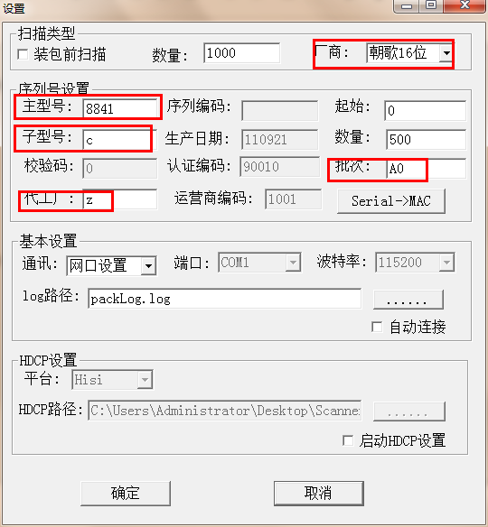  

####3716C 寄存器：
gpio5_0/1/2/3/4/5/7 模式，基地址：0xF8000000  偏移地址: 044, 数值0x00000001(gpio5_0/1)  
复用寄存器基地址：0xF8A21000      
gpio1_5 模式：偏移地址/数值 034/0  
gpio8_4 模式：偏移地址/数值 0F0/1  
gpio17_0 模式：偏移地址/数值 200/0  
gpio 高低电平配置地址：  
gpio1 基地址：0xF8B21000  
gpio5 基地址：0xF8004000  
gpio8 基地址：0xF8B28000  
gpio17 基地址：0xF8B31000  

####制作各种镜像文件：
 550 * 1024 * 1024 = 576716800  
$ANDROID_BUILD_TOP/out/host/linux-x86/bin/make_ext4fs -s -l 576716800 -a user_app ./user_app.img ./user_app  
$ANDROID_BUILD_TOP/out/host/linux-x86/bin/simg2img user_app.img user_app.ics.ext4  
 248 * 1024 * 1024 = 260046848  
$ANDROID_BUILD_TOP/out/host/linux-x86/bin/make_ext4fs -s -l 260046848 -a backup ./backup.img ./backup  
$ANDROID_BUILD_TOP/out/host/linux-x86/bin/simg2img backup.img backup.ics.ext4  

####HDCP:
从不支持HDCP频道切换到支持HDCP的频道，做了两件事：  
a、开启HDCP,设置HDCP属性后由芯片逻辑和电视自行完成认证，软件无法干预；  
b、切换制式；

####马电盒子测试账号mac：
000763e3a13d

####iptv 账号：
10807/1

####马电HyppTV配置：
IPTV Settings :  
    Primary Address:  http://10.10.10.68:33200/EPG/jsp/index.jsp  
Date and Time:  
    NTP server address:  10.10.10.80  
Account:  
    4455/1  
ott Account: 201345/1  

####数据库操作(浙江联通epg地址)：
cd  /data/data/com.android.providers.settings/databases  
sqlite3 settings.db  
select * from secure;  
select * from secure where name='tvos_home_page';  
update secure set value='http://101.69.250.135:8082/EDS/jsp/AuthenticationURL'  where name='tvos_home_page';  

####网卡4mA、8mA鉴别：
himd.l 0x10200068  
himd.l 0x10200070  
两个寄存器都需要查看，如果是0x102则是4mA,0x106为8mA  
单网卡只需关注68寄存器  
3716M上需要配置此网卡能力，3716C不需要  

####浙江移动(添加四个参考帧)：
mkbootimg --kernel uImage --ramdisk ramdisk.img   --cmdline  "mem=307M vmalloc=400M console=ttyAMA0,115200 extra_ref=4 extra_disp=0 lpj=5996758 mtddev=blackbox androidboot.console=ttyAMA0 mmz=ddr,0,0x9D600000,42M mtdparts=hi_emmc:" --base 0x80000000 --output boot.img

####马电融合版本新内存分配（307M）：
//打开串口的bootimg：  
除了需要将cmdline中的console=ttyAMA0,115200  androidboot.console=ttyAMA0,   还需要init.rc中去掉sw_monitor的启动，顺便打开一下adb  
//ramdisk.img  
mkbootfs out/target/product/godbox/root | minigzip > ramdisk.img  
//boot.img-->boot-for-factoryimg.img  
mkbootimg --kernel kernel/arch/arm/boot/uImage --ramdisk ramdisk.img   --cmdline  "mem=307M vmalloc=400M console=NULL  lpj=5996758 mtddev=blackbox androidboot.console=NULL mmz=ddr,0,0x9BA00000,42M mtdparts=hi_emmc:" --base 0x80000000 --output boot.img  
（swbootsign:device/hisilicon/godbox/prebuilt/swboot_sign/swsign -f boot_1.img_test -s device/hisilicon/godbox/prebuilt/swboot_sign/sunniwell_rsa_priv.txt -t kernel -e 0）  
//boot.img-->boot-for-updatezip.img  
mkbootimg --kernel BOOT/uImage --ramdisk ramdisk.img   --cmdline  "mem=307M vmalloc=400M console=NULL  lpj=5996758 mtddev=blackbox androidboot.console=NULL mmz=ddr,0,0x9BA00000,42M mtdparts=hi_emmc:" --base 0x80000000 --output boot_update.img  
（swbootsign:device/hisilicon/godbox/prebuilt/swboot_sign/swsign -f boot_1.img_test -s device/hisilicon/godbox/prebuilt/swboot_sign/sunniwell_rsa_priv.txt -t kernel -e 1）  
//打开串口版本：boot.img-->boot-for-updatezip.img  
mkbootimg --kernel BOOT/uImage --ramdisk ramdisk.img   --cmdline  "mem=307M vmalloc=400M console=ttyAMA0,115200  lpj=5996758 mtddev=blackbox androidboot.console=ttyAMA0 mmz=ddr,0,0x9BA00000,42M mtdparts=hi_emmc:" --base 0x80000000 --output boot_update.img  
（swbootsign:device/hisilicon/godbox/prebuilt/swboot_sign/swsign -f boot_1.img_test -s device/hisilicon/godbox/prebuilt/swboot_sign/sunniwell_rsa_priv.txt -t kernel -e 1）  
  

####浙江联通8040c（EMMC）制作镜像：
mkbootfs out/target/product/godbox/root | minigzip > ramdisk.img  
mkbootimg  --kernel kernel/arch/arm/boot/uImage --ramdisk ramdisk.img  --cmdline "mem=335M vmalloc=400M console=ttyAMA0,115200 lpj=5996758 mtddev=blackbox androidboot.console=ttyAMA0 mmz=ddr,0,0x9D600000,42M mtdparts=hi_emmc:"  --base 0x80000000 --output boot.img  
///////////////有待验证/////////////////  
mkbootfs out/target/product/godbox/recovery/root/ | minigzip  > ramdisk-recovery.img  
mkbootimg --kernel kernel/arch/arm/boot/uImage --ramdisk ramdisk-recovery.img --cmdline "mem=452  console=ttyAMA0,115200 mmz=ddr,0,0x9c400000,60M mtdparts=hi_emmc:" --base 0x80000000 --output recovery.img  
///////////////有待验证/////////////////  
 

####串口寄存器设置（gpio7_1）：
himm 0x10203130 0x01  
himd.l 0x101ed400  
himm 0x101ed400 0xc2  
himd.l 0x101ed3fc         
himm 0x101ed3fc 0xfd （关）  
himm 0x101ed3fc 0xff （开）  

####stb管理工具：
 huawei/.287aW

####backup 分区：
mount -t ext4 /dev/block/mmcblk0p5  /backup

####PTCL（1G内存）制作镜像：
制作ramdisk  
mkbootfs out/target/product/godbox/root | minigzip > ramdisk.img  
添加播放控制参数：extra_ref=6 extra_disp=0，vdec增大24M，mem相应减小24M   
==== mkbootimg --kernel  kernel/arch/arm/boot/uImage --ramdisk ramdisk.img --cmdline "mem=731M vmalloc=600M  extra_ref=6 extra_disp=0 console=ttyAMA0,115200 lpj=5996758 mtddev=blackbox androidboot.console=ttyAMA0 loglevel=0  mmz=ddr,0,0xBAA00000,42M mtdparts=hi_emmc:" --base 0x80000000 --output boot.img  
====init.godbox.sh对应参数：/system/busybox/sbin/insmod /system/lib/modules/hi_mmz.ko mmz=vdec,0,0xB1B00000,69M:jpeg,0,0xB6000000,12M:ddr,0,0xB6C00000,52M  
添加播放控制参数：extra_ref=12 extra_disp=0，vdec增大48M，mem相应减小48M  
====mkbootimg --kernel kernel/arch/arm/boot/uImage --ramdisk ramdisk.img --cmdline "mem=707M vmalloc=600M  extra_ref=12 extra_disp=0 console=ttyAMA0,115200 lpj=5996758 mtddev=blackbox androidboot.console=ttyAMA0 loglevel=0  mmz=ddr,0,0xB9200000,42M mtdparts=hi_emmc:" --base 0x80000000 --output boot.img  
====init.godbox.sh对应参数：/system/busybox/sbin/insmod /system/lib/modules/hi_mmz.ko mmz=vdec,0,0xB0300000,93M:jpeg,0,0xB6000000,12M:ddr,0,0xB6C00000,52M  
添加loglevel版本mkbootimg:  
====mkbootimg --kernel kernel/arch/arm/boot/uImage --ramdisk ramdisk.img --cmdline "mem=755M vmalloc=600M console=ttyAMA0,115200 lpj=5996758 mtddev=blackbox androidboot.console=ttyAMA0 loglevel=0 mmz=ddr,0,0xBC200000,42M mtdparts=hi_emmc:" --base 0x80000000 --output boot.img  
====init.godbox.sh对应参数：/system/busybox/sbin/insmod /system/lib/modules/hi_mmz.ko mmz=vdec,0,0xB3300000,45M:jpeg,0,0xB6000000,12M:ddr,0,0xB6C00000,52M
编译mkbootimg（ddr增大20M方案）  
mkbootimg --kernel kernel/arch/arm/boot/uImage --ramdisk ramdisk.img --cmdline "mem=755M vmalloc=600M console=ttyAMA0,115200 lpj=5996758 mtddev=blackbox androidboot.console=ttyAMA0 mmz=ddr,0,0xBC200000,42M mtdparts=hi_emmc:" --base 0x80000000 --output boot.img
编译mkbootimg（hisi推荐内存分配方案）  
mkbootimg --kernel kernel/arch/arm/boot/uImage --ramdisk ramdisk.img --cmdline "mem=775M vmalloc=600M console=ttyAMA0,115200 lpj=5996758 mtddev=blackbox androidboot.console=ttyAMA0 mmz=ddr,0,0xBD600000,42M mtdparts=hi_emmc:" --base 0x80000000 --output boot.img
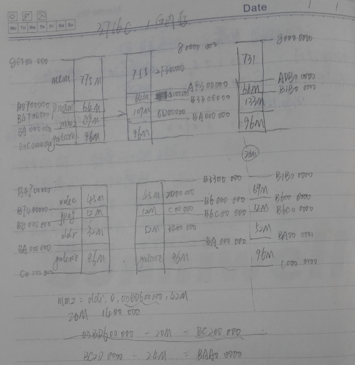  

####sdk完整名称：
HiSTBAndroidV400R001C00SPC050B012  
打51补丁：  
HiSTBAndroidV400R001C00SPC051  

####通过apache模拟ott：
修改一个m3u8文件，只带一个切片即所需测试的ts文件。  
启动iptv后 swgetlog  
sw_media_start http://10.10.4.31/ott/dd.m3u8  

####misc.img信息：
udisk_factory_burn  
boot-recovery  
mmc read 0 82000000 3000 1000（2M/除512）  
tftp 82000000 misc_8040c.img 200000（2M/未除512）  

####8840C(EMMC)编译system.img,system.ics.ext4
make_ext4fs -s -l 335544320 -a system out/target/product/godbox/obj/PACKAGING/systemimage_intermediates/system.img out/target/product/godbox/system  
cd out/target/product/godbox; ./mksystemext4  （使用out/target/product/godbox下的system.img）  

####hdmi输出调试工具：
disp getfmt  
disp --help

####LOGE配置：
    #include <cutils/logd.h>
    #include <cutils/logprint.h>
    #define LOG_TAG "wilsonflying_hisisample"
    Android.mk 添加log库的链接:
    LOCAL_SHARED_LIBRARIES += \
                               libcutils \
                               libutils \
                               liblog

####8000E 和 8000A硬件设计相同

####马电8040E 分区及镜像烧写
setenv ipaddr 172.16.6.56;setenv serverip 172.16.6.55;
setenv ipaddr 10.10.4.35;setenv serverip 10.10.4.31
tftp 82000000 *.img

####tftp  方式烧写emmc镜像
下载：tftp 82000000 misc.img  
recovery.img    
mmc write 0 82000000 4000 8000  
boot.img  
mmc write 0 82000000 10000 4000  
misc    
mmc write 0 82000000 3000 1000  
logo  
mmc write 0 82000000 c000 4000  
deviceinfo  
mmc write 0 82000000 2000 1000  

####马电ott-iptv手动编译bootimg（支持串口版本）：
 mkbootimg --kernel device/hisilicon/godbox/prebuilt/Image/uImage --ramdisk ../../tmp/ramdisk.img_rong   --cmdline  "mem=317M vmalloc=400M console=ttyAMA0,115200  lpj=5996758 mtddev=blackbox androidboot.console=ttyAMA0 mmz=ddr,0,0x9C400000,42M mtdparts=hi_emmc:" --base 0x80000000 --output boot.img_317_serial

####马电ott-iptv手动编译bootimg：
mkbootimg --kernel device/hisilicon/godbox/prebuilt/Image/uImage --ramdisk ../../tmp/ramdisk.img_rong   --cmdline  "mem=317M vmalloc=400M console=NULL  lpj=5996758 mtddev=blackbox androidboot.console=NULL mmz=ddr,0,0x9C400000,42M mtdparts=hi_emmc:" --base 0x80000000 --output boot.img_317

####马电ott手动编译bootimg（支持串口版本）：
mkbootimg  --kernel device/hisilicon/godbox/prebuilt/Image/uImage --ramdisk /home/sunhuasheng/tmp/ramdisk.img_rong  --cmdline "mem=335M vmalloc=400M console=ttyAMA0,115200 lpj=5996758 mtddev=blackbox androidboot.console=ttyAMA0 mmz=ddr,0,0x9D600000,42M mtdparts=hi_emmc:"  --base 0x80000000 --output boot.img_335_serial

####马电ott手动编译bootimg：
mkbootimg  --kernel device/hisilicon/godbox/prebuilt/Image/uImage --ramdisk /home/sunhuasheng/tmp/ramdisk.img_rong  --cmdline "mem=335M vmalloc=400M console=NULL lpj=5996758 mtddev=blackbox androidboot.console=NULL mmz=ddr,0,0x9D600000,42M mtdparts=hi_emmc:"  --base 0x80000000 --output boot.img_335

####tftp 下载镜像到pc:
setenv ipaddr 10.10.4.35;setenv serverip 10.10.4.31  
nand read 82000000 1800000 800000  
tftp 82000000 misc_normal.img 800000  
  

####浙江联通fastboot中打开日志（去掉loglevel=0）：
setenv bootargs 'mem=335M vmalloc=400M console=ttyAMA0,115200 lpj=5996758 mtddev=blackbox androidboot.console=ttyAMA0 mmz=ddr,0,0x9D600000,42M mtdparts=hinand:8M(fastboot),8M(partition),8M(deviceinfo),8M(misc),16M(recovery),8M(logo),16M(boot),248M(backup),48M(swdb),224M(cache),320M(system),384M(userdata),256M(data_dalvik),1024M(user_app),1520M(sdcard) androidboot.mac=00:07:63:00:00:00 androidboot.standard=1080i_50Hz  androidboot.serialno=0010010900100000A000000000000000'  
nand read 82000000 3800000 800000;bootimg 0x82000000  

####有关logo：
Fastplay.exe打出logo.img后放到小系统 resouce/Images/logo.img  
小系统中main.mk中有INSTALLED_LOGO_TARGET 控制是否打入logo的img  

####有关android内置命令：
sw_cp ; toolbox rm;swch_mod;  

####有关bootimg：
device/hisilicon/godbox/BoardConfig.mk 修改boot.img中的cmdline  
需要把kernel 编译出来了的uImage  放到device/hisilicon/godbox/prebuilt/Image/  
根目录下make bootimage  

####深圳wifi
TP_LINK_1234/0987654321  
TP_LINK_123/075582883008  

####手动制作升级包：  
把打开串口的boot.img 压缩到zip包里  
cd enable_serial; zip -qry  ../enable-serial.zip   ./*   
然后签名：  
java  -jar  signapk.jar  -w  testkey.x509.pem  testkey.pk8  save-stb-serial.zip  save-stb-serial-signed.zip  

####logcat 打印时间：
logcat -v time

####生产测试版本
先烧fastboot、ptable、misc、recovery，然后在开机时候升级其他部分

####调试技巧
addr2line -e out/target/product/godbox/symbols/system/lib/libswca.so 0x2d3c  
I/DEBUG   (  946):          #00  pc 00002d3c  /system/lib/libswca.so (std_ping)  
I/DEBUG   (  946):          #01  pc 0000f36a  /system/bin/swproduct_wifi  

####进入配置页面，STB管理工具
172.16.6.109:8082  
huawei  
28780808  

####shell环境
busybox sh  

####remount
mount -o remount system /system
mount -o remount  /   /
mount -o  remount,ro /  /

####串口启动升级
把升级包命名为update.zip，push 到/cache然后到命令行输入以下命令，再重启盒子就可以了。
mkdir /cache/recovery;echo --update_package=CACHE:update.zip >/cache/recovery/command;echo boot-recovery > /dev/block/mtdblock2;sync;  
 

####bootargs位置：
device/hisilicon/godbox/BoardConfig.mk  

####签名:
 java -jar out/host/linux-x86/framework/signapk.jar -w build/target/product/security/testkey.x509.pem build/target/product/security/testkey.pk8 ~/full_godbox-ota-80102009.zip ~/full_godbox-ota-80102009_sig.zip

####TM/8940/8800项目代码地址：
repo init -u git@svn.xxHi3716C-ics.git/manifest.git -b ics-hisi3716-121219-spc050

####制作uboot.img
/home/guojia/zhejiang/build/linux-x86/bin/mkbootimg --kernel /home/guojia/zhejiang/resouce/boot/uImage --ramdisk /home/guojia/zhejiang/out/Version/ramdisk.img --cmdline  "mem=312M extra_ref=4 extra_disp=0 vmalloc=400M console=ttyAMA0,115200 lpj=5996758 mtddev=blackbox androidboot.console=ttyAMA0 mmz=ddr,0,0x9D600000,42M mtdparts=hinand:" --base 0x80000000 --output /home/guojia/zhejiang/out/Version/boot.img

####HiMediaPlayer.cpp路径
frameworks/base/media/libmediaplayerservice/HiMediaPlayer.cpp

####调节驱动打印级别：
echo 8 > /proc/sys/kernel/printk

####有关启动时间优化的几个点：
1、裁剪bootloader  
   裁剪不必要的driver和运行的代码  
2、裁剪linux kernel，缩小kernel的size  
   采用Image镜像方式load kernel，而不是采用压缩的kernel.  
   把裁剪不必要的driver.  
   把usb、mmc、ext3、ext4、vfat、NTFS等等没有必要优先加载的driver做成module形式.  
3、优化Android启动脚本，  
  把Android init.rc脚本优化，去掉不必要运行脚本命令。  

####有关Nand Flash高温数据跳变
一般Nand Flash特别是MLC对温度都有一定的要求，在机顶盒生产贴片过炉的过程中，温度较高，可能会使Flash的一些bit位发生跳变，导致机顶盒里的版本数据状态不可控。  
为了降低这种风险，不再使用贴片前将整个镜像烧录到flash中，而是采用二次升级的方式来完成版本写入。基本思路是，制作生产版本时，我们提供一个镜像一个升级包，镜像包括loader、misc、recovery，升级包包括logo、kernel、system。生产时先使用编程器烧录镜像，高温过炉贴片后，机顶盒接u盘进行一次升级，完成整个机顶盒版本的烧录。

####bootimg制作：
 ../../../host/linux-x86/bin/mkbootfs root_bk | minigzip >ramdisk.img
../../../host/linux-x86/bin/mkbootimg --kernel uImage --ramdisk ramdisk.img.gz --cmdline  "mem=335M vmalloc=400M console=ttyAMA0,115200 loglevel=0 lpj=5996758 mtddev=blackbox androidboot.console=ttyAMA0 mmz=ddr,0,0x9D600000,42M mtdparts=hi_mmc:" --base 0x80000000 --output boot.img

####boot和recovery映像的文件结构
boot和recovery映像并不是一个完整的文件系统，它们是一种android自定义的文件格式，该格式包括了2K的文件头，后面紧跟着是用gzip压缩过的内核，再后面是一个ramdisk内存盘，然后紧跟着第二阶段的载入器程序（这个载入器程序是可选的，在某些映像中或许没有这部分）。  
/*  
** +-----------------+  
** | boot header    | 1 page  
** +-----------------+  
** | kernel              | n pages   
** +-----------------+  
** | ramdisk           | m pages   
** +-----------------+  
** | second stage  | o pages  
** +-----------------+  
**
** n = (kernel_size + page_size - 1) / page_size   
** m = (ramdisk_size + page_size - 1) / page_size  
** o = (second_size + page_size - 1) / page_size  
*/  
boot的ramdisk映像是一个最基础的小型文件系统，它包括了初始化系统所需要的全部核心文件，例如:初始化init进程以及init.rc（可以用于设置很多系统的参数）等文件。  
[android rom制作之bootimg的详细介绍和使用](http://www.cnblogs.com/weisenz/archive/2012/03/30/2425452.html)  

####zygote 入口：
frameworks/base/cmds/app_process$

####bootchart：
$ adb shell 'echo 120 > /data/bootchart-start' $ adb shell 'mkdir /data/bootchart'
java -jar /usr/share/bootchart/bootchart.jar /tmp/android-bootchart/bootchart.tgz

####编译:
source build/envsetup.sh  
lunch 4 2 2  
mmm -B hardware/libhardware_legacy/ -j4  
mmm -B frameworks/base/core/jni/  
打升级包  
make otapackage  

####adb使用
adb kill-server  
adb connect xxx.xxx.xxx.xxx:5555  
adb shell  
adb push 驱动文件 /system/lib/modules/  

###Linux 阶段

####flash同步问题：
	open(mtddevname, O_RDWR|O_SYNC);
	fflush(f);
	fsync(fileno(f));

####vi快捷键
vi中替换快捷键：ctrl+r+r  
vi删除带有特定字符的行：   :g/\.svn/d

####windows下dns清理：
1. 清除ARP缓存，arp -d *
2. 清除NETBT，nbtstat -R
3. 清除DNS缓存，ipconfig /flushdns

####有关svn仓库上传sdk代码
重要：sdk打补丁，需要svn st一下，以便发现新添加的目录及文件，svn st -u -q只能发现有改动的文件

####低级错误、后果严重（from陶安然）
     gcc xx.c -o xx.c

####全局变量重名不报错，隐性危险，可能导致段错误

####sticky bit--rwxrwxrwt中t位
如何才能使一个目录既可以让任何用户写入文件，又不让用户删除这个目录下他人的文件，sticky就是能起到这个作用。stciky一般只用在目录上，用在文件上起不到什么作用。  
如果某个目录设置了sticky bit（是在other用户的权限上设置的，设置后可执行位从x变成了t），那么用户在该目录下可以创建文件（当然前提是用户具有写权限和可执行权限，如果具有可执行权限，设置sticky bit后是t；如果没有可执行权限的话，设置sticky bit后是T），而且可以删除自己创建的文件，但是，不能删除其他用户创建的文件，这样就起到了一种保护作用了。  
更多详情见：[linux sticky bit 目录权限 rwt权限](http://blog.csdn.net/fly542/article/details/7108037)  

####有关操作符 “?:”
`condition ? value_if_true : value_if_false  `  
C 语言变种[编辑]  
GNU 允许C 语言省略条件表达式中的表达式2省略, 此时表示表达式2与表达式1相同.例如  
a = x ? : y;  
等价于  
a = x ? x : y;  
但是如果 x 是一个表达式, 仅求值一次. C#提供了类似的特性  
a = x ?? y;  
与"x?:y"的用法不同, ??只判断 x 是否为null, 而不是判断真假.  

####vim中在多行的头部加某字符
:%s/\n/\r\n##/

####生成ctags
	find ~/myproject -name “*.h” -o -name “*.c” -o -name “*.cpp” > mytags.files
	ctags -f tags -L mytags.files

####有关宏define：
	#ifdef MTD_OLD
	...
	#endif

	#if defined(CONFIG_BOOTARGS)
	...
	#endif

####结构体数组部分赋值
	struct envdev_s {
        char devname[16];               /* Device name */
        ulong devoff;                   /* Device offset */
        ulong env_size;                 /* environment size */
        ulong erase_size;               /* device erase size */
        ulong env_sectors;              /* number of environment sectors */
        uint8_t mtd_type;               /* type of the MTD device */
	};
	static struct envdev_s envdevices[2] =
	{
        {
                .mtd_type = MTD_ABSENT,
        }, {
                .mtd_type = MTD_ABSENT,
        },
	};

####各种音视频接口
[视频输入输出常用接口（TV，AV,S-Video<s端子>,YCbCr/PCbCr<色差分量>,VGA,Scart,DVI/HDMI](http://hi.baidu.com/junlin8848/item/1a8e2bd7fc8b1d312b35c781)

####新接口
setbuf  
memstr  
bzere(void *s, size_t n)  

####grep剔除某个目录名
grep --exclude-dir=.git  internal_build_id_makefile . -ri

####debug printf
	62 /*define a swlog interface for debug*/
	63 #ifdef DEBUG
	64 #define swlog(format,...) printf("####[%s,%d]" format "\n",__FUNCTION__,__LINE__,##__VA_ARGS__)
	65 #define swllog(format,...) printf("####[%s,%s,%d]" format "\n",__FILE__,__FUNCTION__,__LINE__,##__VA_ARGS__)
	66 #else
	67 #define swlog(format,...) /* can't see me ^o^ */
	68 #define swllog(format,...) /* can't see me ^o^ */
	69 #endif  

####dd 转文件
	dd if=2.ts of=cut4m_2.ts bs=1M skip=4
	dd if=2.ts of=cut4m_save3m_2.ts bs=1M skip=4 count=3

####代码中定义多个宏进行或/与的判断
	304 #if !(defined SUPPORT_GUANGDONG || defined SUPPORT_HUAWEI_product)
	305     else  //其他不规则的参数值，则重置回1080i_50Hz
	306     {
	307         fprintf( stderr, "[hd_standard] Not Right! Auto Set 1080i_50Hz\n" );
	308         sw_parameter_set("hd_standard","1080i_50Hz");
	309     }
	310 #endif

 	118 #if       SiTRACES_FEATURES == SiTRACES_FULL 
 	119     FILE *file;
 	120 #endif /* SiTRACES_FEATURES == SiTRACES_FULL */

####E2PROM与FLASH
 flash里存储的是从设置页面能够设置的参数，以及和机顶盒系统相关的固定不变的参数 （不能把以前E2Prom里的参数都写到flash里，因为flash的寿命（擦写次数）远小于E2PROM，且E2PROM是按字节来写的，而 flash是按block来写的，在flash擦写操作的时候断电，其他参数也会丢失），因此flash里存储的参数应该尽量少,做生产版本需要特别注意。

####有关UBIfs
mkfs.ubifs -r rootfs -m 2048 -e 129024 -c 812 -o ubifs.img  
-r：制定文件内容的位置  
    -m：页面大小  
    -e：逻辑擦除块大小  
    -p：物理擦除块大小  
    -c：最大的逻辑擦除块数量  
    对我们这种情况，文件系统最多可以访问卷上的129024*812=100M空间  
    -s：最小的硬件输入输出页面大小，如：k9f1208为256(上下半页访问)  
更多详情见[UBI文件系统](http://www.cnblogs.com/leaven/archive/2011/04/19/2021388.html)  

####静态函数调用关系分析工具
cflow

####内存调试工具
1. ElectricFence 函数库libefence.a
2. valgrind

####清除ftp之前已保存的用户名和密码
[清除ftp的登录用户名密码](http://hi.baidu.com/niceyou/item/6bd3d73ba5c52187b611db5b)

####加载库环境变量
export LD_LIBRARY_PATH=$LD_LIBRARY_PATH:/tmp

####养成memset习惯
数组、申请的buf，在用之前来个memset，避免莫名其妙的问题
 
####对齐问题
（1）自然对界(natural alignment)即默认对齐方式，是指按结构体的成员中 size 最大的成员对齐。  
（2）指定对界    
一般地，可以通过下面的方法来改变缺省的对界条件：    
· 使用伪指令#pragma pack (n)，编译器将按照 n 个字节对齐；   
· 使用伪指令#pragma pack ()，取消自定义字节对齐方式。  
注意：如果#pragma pack (n)中指定的 n 大于结构体中最大成员的 size，则其不起作用，结构体仍然按照 size 最大的成员进行对界。  
（3）另外，通过__attribute((aligned (n)))也可以让所作用的结构体成员对齐在 n 字节边界上，但是它较少被使用，因而不作详细讲解

####signal机制
有关signal机制及kill、alarm、settimer系统调用等内容：[Linux 信号signal处理机制](http://www.cnblogs.com/taobataoma/archive/2007/08/30/875743.html)  

####有关assert
使用assert的缺点是，频繁的调用会极大的影响程序的性能，增加额外的开销。所以在调
试结束后，可以通过在包含#include <assert.h>的语句之前插入 #define NDEBUG 来
禁用 assert 调用，示例代码如下：
	
	#include <stdio.h>
	#define NDEBUG
	#include <assert.h>
注意不能使用改变环境的语句,因为ASSERT只在DEBUG时生效,如果这么做,会使用程序关掉DEBUG后真正运行时遇到问题

####有关find: paths must precede expression
	#touch {1,2,3,4}.txt
	#find . -name *.txt
	find: paths must precede expression: 2.txt
出现这个提示是因为星号被展开为当前目录下所有的文件  
想要星号不被展开就需要**加上括号或者反斜杠转义**  

	 # find . -name '*.txt'  
	 find . -name '*.txt'  
	 ./4.txt  
	 ./2.txt  
	 ./3.txt  
	 ./1.txt  

####代码可以完全做到不包含头文件，但出于便于阅读还是写好头文件。详见[C语言的头文件是必须的吗？](http://blog.chinaunix.net/uid-24774106-id-3291005.html)

####有关GNU binutils
1. addr2line 根据地址获取代码所在位置及函数名，例：addr2line 0x401100 -f -e a.out  
c++中允许重载，那就回有一些函数重名，c++编译器会对每一个函数根据其输入参数采用一定的编码方式，从而形成不同的c函数名，这一过程称之为名字的分裂过程。
2. ar是用来管理档案文件的，主要用来管理静态库。打包静态库：ar crx libab.a a.o b.o  解压静态库：ar x libab.a
3. nm用来列出程序文件中的符号，包括函数名、变量名。例：nm -n a.out 会列出三列数据，分别为符号对应的地址，符号所在的段，符号名称。  
其中符号所在的段采用的符号对应关系如下：  
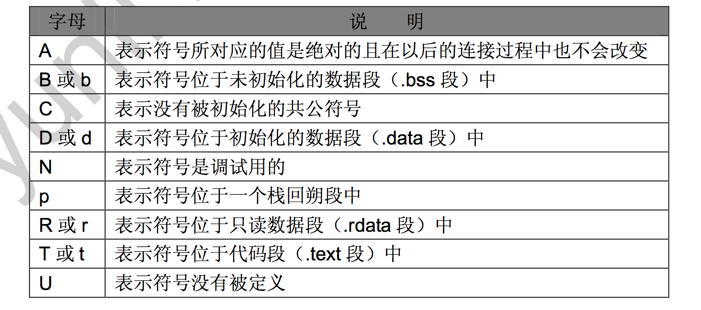  
nm的几个结论：  
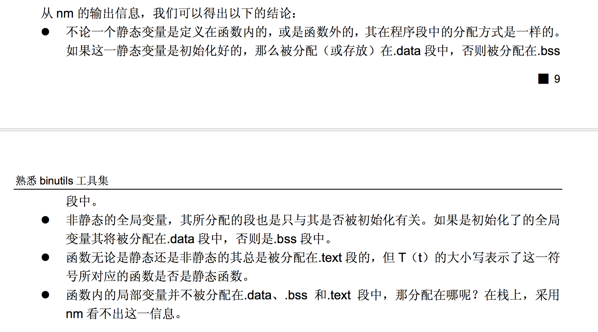  
4. objdump 可以用来查看目标程序中的段信息和调试信息,也可以用来对目标程序进行反汇编。例：objdump -d a.out 采用-d 选项可以显示程序文件的汇编代码;objdump -W a.out 参数-W可以显示 C/C++源程序和与之对应的汇编代码；objdump -f a.out 参数-f 选项可以显示目标文件的头信息。
5. objcopy 可以对已经生成的程序文件进行一系列编辑，例objcopy -j .txt a.out onlytext.file 或者objcopy -j .txt -j .data a.out text_data.file 参数-j可以指定需要抽取的哪一段；objcopy -R .txt a.out notext.file 参数-R用来指定需要删除的段；objcopy --strip-debug a.out 还有strip功能。
6. ranlib 用于在档案文件中生成文件索引。ar中的s参数也是具有同样的功能。当档案文件增加了索引后,对于其中文件的存取速度将更快。如果档案文件是一个静态库,那么我们在使用静态库进行连接时,其速度将会有所加快。
7. readelf 主要用来查看头信息，其大部分功能objdump都有。例：readelf -h a.out
8. size 工具也很简单,就是列程序文件中各段的大小。
9. strings 用于查看我们的程序文件中的可显示字符。strings 看到的信息都是放在.data 段(或是.rdata)中的,比如,我们在 C/C++程序中使用__FILE__ 宏时,就会在.rdata 段中生成函数名字符串。也就是说,即使你用 strip 将程序文件中的调试信息都 去掉,你仍然可以通过 strings 看到这些信息。
10. strip 主要用于去除程序文件中的调试信息以便减小文件的大小。
更多详情见 熟悉binutils工具集.pdf

####有关Makefile
0.变量赋值  
先看第一种方式，也就是简单地使用“=”号，在“=”左侧是变量，右侧是变量的值，右侧变
量的值可以定义在文件的任何一处，也就是说，右侧中的变量不一定非要是已定义好的值，其也可以使用后面定义的值。但这种形式也有弊端，那就是递归定义，如CFLAGS = $(CFLAGS) -O 这会让make 陷入无限的变量展开过程中。当然，make 有能力检测这样的定义，并会报错。另外，如果在变量中使用函数，这种方式会让make 运行时非常慢，更糟糕的是，它在使用两个make 函数wildcard 和shell 时会出现不可预知的错误，因为不会知道这两个函数会被调用多少次。  
为了避免上面的情形，可以使用make 中的另一种用变量来定义变量的方法。这种方法使用的是“:=”操作符，值得一提的是，前面的变量不能使用后面的变量，只能使用前面已定义好了的变量。  
可以使用“+=”操作符给变量追加值。  
1.$(basename <names...>)  
名称：取前缀函数——basename。  
功能：从文件名序列<names>中取出各个文件名的前缀部分。  
返回：返回文件名序列<names>的前缀序列，如果文件没有前缀，则返回空字串。  
示例：$(basename src/foo.c src-1.0/bar.c hacks)返回值是“src/foo src-1.0/bar
hacks”。  
2.`$(foreach <var>,<list>,<text>)`     
	
	这个函数的意思是，把参数<list>中的单词逐一取出放到参数<var>所指定的变量中，然后再执行<text>所包含的表达式。  
	names := a b c d  
	files := $(foreach n,$(names),$(n).o)  
	上面的例子中，$(name)中的单词会被挨个取出，并存到变量“n”中，“$(n).o”每次根据“$(n)”计算出一个值，这些值以空格分隔，最后作为foreach 函数的返回，所以，$(files)的值是“a.o b.o c.o d.o”。  

3.call函数是唯一一个可以用来创建新的参数化的函数。你可以写一个非常复杂的表达式，
这个表达式中，你可以定义许多参数，然后你可以用call 函数来向这个表达式传递参数。  
其语法是：  

	$(call <expression>,<parm1>,<parm2>,<parm3>...)
	当make 执行这个函数时，<expression>参数中的变量，如$(1)，$(2)，$(3)等，会被参数<parm1>，<parm2>，<parm3>依次取代。  
4.origin 函数不像其它的函数，他并不操作变量的值，他只是告诉你你的这个变量是哪里来
的？其语法是：  

	$(origin <variable>)
	注意，<variable>是变量的名字，不应该是引用。返回值可以是如下内容：“undefined”(未定义)，“default”(默认的定义，比如“CC”这个变量),“environment”（环境变量，并且当Makefile 被执行时，“-e”参数没有被打开),“file”(变量被定义在Makefile 中),“command line”(变量是被命令行定义的),“override”(被override 指示符重新定义的),“automatic”(一个命令运行中的自动化变量)  
5..PHONY 表示是一个“伪目标”，向make 说明不管是否有这个文件，这个目标就是“伪目标”。  
6.如果当前环境中定义了环境变量MAKEFILES，make 会把这个变量中的值作一个类似于include 的动作。这个变量中的值是其他的makefile 文件，用空格分隔。只是它和include不同的是，从这个环境变量中引入的makefile 文件的“目标”不会起作用，如果环境变量中定义的文件发现错误，make 也会忽略。  
7.make 使用的是拖延战术，如果变量出现在依赖关系的规则中，仅当这条依赖被决定要使用了，变量才会在其内部展开。  
8.当make 需要去找寻文件的依赖关系时，可以在文件前加上路径，但最好的方法是把一个路径告诉make，让make 自动去找。makefile 文件中的特殊变量VPATH 就是完成这个功能的。如果没有指明这个变量，make 只会在当前的目录中去找寻依赖文件和目标文件；如果定义了这个变量，make 就会在当前目录找不到的情况下，到所指定的目录中去找寻文件。  

	vpath <pattern> <directories>
	vpath %.h ../headers
	该语句表示，要求make 在../headers 目录下搜索所有以.h 结尾的文件(如果某文件在当前目录没有找到的话)。可以连续地使用vpath 语句，以指定不同搜索策略。如果连续的vpath 语句中出现了相同的<pattern>，或是被重复了的<pattern>，make 会按照vpath 语句的先后顺序来执行搜索。
9.自动化变量“$@”。这个变量表示目前规则中所有目标的集合，“$<”表示所有的依赖目标集，"$^"表示第一个依赖文件，  
10.静态模式可以更加容易地定义多目标的规则，可以让规则变得更加灵活和有弹性。语法如下：

	<targets ...>: <target-pattern>: <prereq-patterns ...>
	<commands>
	实例：objects = foo.o bar.o
	all: $(objects)
	$(objects): %.o: %.c
	$(gcc) -c $(CFLAGS) $< -o $@
	实例中，指明了目标从$object 中获取，“%.o”代表所有以“.o”结尾的目标，也就是foo.o bar.o，即变量$object 集合的模式，而依赖模式“%.c”则取模式“%.o”的“%”，也就是foo bar，并为其加上“.c”的后缀，于是，依赖目标就是foo.c bar.c。
11.使用GCC 的一个-M 的选项，即自动寻找源文件中包含的头文件，并生成一个依赖关系。例如，如果执行下面的命令：gcc -M main.c 其输出是：main.o : main.c defs.h  
于是由编译器自动生成依赖关系，而不必再手动书写若干文件的依赖关系，并由编译器自动生成。  
12.如果make 执行时，带入make 参数-n 或--just-print，其只是显示命令，但不会执行命令。这个功能有利于调试makefile 文件，可预览书写的命令的运行顺序及结果。make 参数-s或--slient 表示全面禁止命令的显示。  
13.make 会一条一条地执行命令,需要注意的是，如果要让上一条命令的结果应用在下一条命令上，应该使用分号分隔这两条命令.

	示例一：
	exec:
	cd /home/hchen
	pwd
	示例二：
	exec:
	cd /home/hchen; pwd
	当执行make exec 时，第一个例子中的cd 没起作用，pwd 会打印出当前的makefile 文
	件目录；而第二个例子中，cd 就起作用了，pwd 会打印出“/home/hchen”
14.在命令前面加了一个小减号的目的是，如果某些文件出现问题将被忽略，继续进行后面的操作。 还有一个办法是，给make 加上-i 或是--ignore-errors 参数，这样makefile 文件中的所有命令都会忽略错误。而如果一个规则是以.IGNORE 作为目标的，这个规则中的所有命令都将会忽略错误。这些是不同级别的防止命令出错的方法，可以根据自己的需要设置。还有需要提一下的make 参数是-k 或是--keep-going，这个参数的意思是，如果某规则中的命令出错了，就终止该规则的执行，但继续执行其他规则。  
15.总控makefile 文件的变量可以传递到下级的makefile 文件中(如果显式地声明)，但是不会覆盖下层的makefile 文件中所定义的变量，除非指定了-e 参数。  
如果要传递变量到下级makefile 文件中，可以使用这样的声明：  
export <variable ...>  
如果不想让某些变量传递到下级makefile 文件中，可以这样声明：  
unexport <variable ...>  
16.一个在“嵌套执行”中比较有用的参数，-w 或是--print-directory 会在make 执行的过程中输出一些信息， 并看到目前的工作目录。比如， 如果下级make 目录是/home/hchen/gnu/make，如果使用make -w 来执行，当进入该目录时，会看到：  
make: Entering directory '/home/hchen/gnu/make'.  
而在完成下层make 后离开目录时，会看到：  
make: Leaving directory '/home/hchen/gnu/make'  
当使用-C参数来指定make下层makefile文件时，-w会自动打开.  
17.采用“#”注释符来表示变量定义终止。请注意这里关于“#”的使用，注释符“#”的这种特性值得注意。如果定义一个变量：

	dir := /foo/bar # directory to put the frobs in
	dir 变量的值是/foo/bar，后面还跟了4 个空格，如果使用该变量来指定别的目录
18.变量的高级使用方法，第一种是变量值的替换。可以替换变量中的共有部分，其格式是$(var:a=b)或是${var:a=b}。第2 种高级用法是“把变量的值再当成变量”，其实就是嵌套。  
19.还有一种设置变量值的方法是使用define 关键字。使用define 关键字设置变量的值可以包括
换行符，这有利于定义一系列的命令。define 指示符后面跟的是变量的名字，而重起一行定义变量的值，定义以endef 关键字结束。其工作方式和“=”操作符一样。变量的值可以包含函数、命令、文字，或是其他变量。因为命令需要以[Tab]键开头，所以如果用define 定义的命令变量中没有以[Tab]键开头，make 就不会将其作为命令。  
20.如果make 指定了-e 参数，系统环境变量将覆盖makefile 文件中定义的变量)。因此，如果在环境变量中设置了“CFLAGS”环境变量，就可以在所有的makefile 文件中使用这个变量了。  
21.当make 嵌套调用时，上层makefile 文件中定义的变量会以系统环境变量的方式传递到下层的makefile 文件中。当然，默认情况下，只有通过命令行设置的变量会被传递。而定义在文件中的变量，如果要向下层makefile 文件传递，则需要使用exprot 关键字来声明。
22.还有一个特性是针对make 命令行带入的变量，或是系统环境变量。这个特性非常有用，当设置了这样一个变量，这个变量会作用到由这个目标所引发的所有规则中去。如实例：

	prog : CFLAGS = -g
	prog : prog.o foo.o bar.o
	$(gcc) $(CFLAGS) prog.o foo.o bar.o

####HMS点播发流方法:
HMS server ip： 172.16.11.90  
login_name:  xx  
password: xx  
1. 找一个可以播放的HMS  
2. 既然可以播放，肯定有一个点播卷，  
   如/home/hms/data/c/vod_pub_c  
3. 将ts文件拷贝到点播卷目录下，  
   如/home/hms/data/c/vod_pub_c/stc_nvod.ts  
4. 调用HMS抽帧工具，对TS进行抽帧  
   cd /home/huawei/mdn2000/es/bin  
   ./ts_get_vod_index /home/hms/data/c/vod_pub_c/stc_nvod.ts  
5. 创建一个mdn文件，为空即可  
   touch /home/hms/data/c/vod_pub_c/stc_nvod.ts.mdn  
6. rtsp://hms_ip/stc_nvod.ts  

####ttnet：
开机按遥控器蓝色键进入小系统，按数字键1 进行u盘升级  
mkconfig_ttnet.exe 根据项目编译出来的镜像生成config.ini  
在u盘目录下：/upgrade/DN355_pub_1234 放config.ini 及升级包  
高安kernel签名：  
./swsign -f /mnt/hgfs/share/uImage -s sunniwell_rsa_priv.txt -t kernel -e 0 -b 256  

####打开stbmonitor控制开关：
swboot/swboot_nmp.c  
-#ifndef SUPPORT_SECURELINE  
+//#ifndef SUPPORT_SECURELINE  
     sw_nmp_init();  
-#endif  
+//#endif  

####宽高比显示效果
  
  
  

####广东v3版本安全红线关闭：
export SUPPORT_SECURELINE=n  
export SUPPORT_SECURERECTIFICATION=n  
删除参数 delpara log_targets  
然后保存下： savepara  
重启就好了  

####8840A镜像
mksquashfs rootfs/ rootfs.img  
setenv bootargs 'mem=306M vmalloc=600M console=ttyMTD,blackbox console=ttyAMA0,115200 androidboot.console=ttyAMA0 hardwareID=8840A pcie0_sel=x1  initrd=0x82500000,0x2800000 mmz=ddr,0,0x93200000,110M root=/dev/ram'  
mmc read 0 0x82000000 18800 2800;mmc read 0 0x82500000 1b000 14000;bootm 0x82000000  
mmc read 0 0x82000000 18800 18000;mmc read 0 0x82500000 1b000 14000;bootm 0x82000000  

####DNS server调试
dig -t NS .   
/usr/sbin/ss -l  
netstat -l -t -n  
host www.baidu.com  
dig baidu.com @localhost  
dig baidu.com @172.16.6.117  
ping 220.181.111.86  

####切片
ping 128.63.2.53
./segmenter64 udp://224.1.1.11:1234 /tmp/ts/ hs hs.m3u8 5 5 5 1
./segmenter64 ./ccir3311.ts /tmp/ts/ hs hs.m3u8 5 5 5 1
mount  -t tmpfs -o size=120m  tmpfs /mnt/tmp  
ffplay http://xxx.xxx.xx.xxx/test/CCTV-1/index.m3u8  

####有关I2C
* 只要求两条总线线路:一条串行数据线SDA 一条串行时钟线SCL,SDA 和SCL 都是双向线路，都通过一个电流源或上拉电阻连接到正的电源电压。当总线空闲时，这两条线路都是高电平。连接到总线的器件输出级必须是漏极开路或集电极开路才能执行线与的功能。  
* 每个连接到总线的器件都可以通过唯一的地址和一直存在的简单的主机‘从机关系软件设定地址；主机可以作为主机发送器或主机接收器  
* 串行的8 位双向数据传输位速率在标准模式下可达100kbit/s 快速模式下可达400kbit/s 高速模式下可达3.4Mbit/s
* 片上的滤波器可以滤去总线数据线上的毛刺波保证数据完整
* 数据的有效性：SDA 线上的数据必须在时钟的高电平周期保持稳定。数据线的高或低电平状态只有在SCL 线的时钟信号是低电平时才能改变。  
* 起始和停止条件：在I2C 总线中唯一出现的是被定义为起始S 和停止P 条件的情况。其中一种情况是在SCL 线是高电平时，SDA 线从高电平向低电平切换这个情况表示起始条件；当SCL 是高电平时，SDA 线由低电平向高电平切换表示停止条件。  
* 发送到SDA 线上的每个字节必须为8位。每次传输可以发送的字节数量不受限制。每个字节后必须跟
一个响应位首先传输的是数据的最高位（MSB）。如果从机要完成一些其他功能后(例如一个内部中断服务程序)才能接收或发送下一个完整的数据字节,可以使时钟线SCL 保持低电平迫使主机进入等待状态，当从机准备好接收下一个数据字节并释放时钟线SCL 后数据传输继续。  
* 数据传输必须带响应。相关的响应时钟脉冲由主机产生，在响应的时钟脉冲期间发送器释放SDA 线（
高）。在响应的时钟脉冲期间，接收器必须将SDA 线拉低，使它在这个时钟脉冲的高电平期间保持稳定的低电平。
* 仲裁：连接多于一个微控制器到I2C 总线的可能性意味着超过一个主机可以同时尝试初始化传输数据。如果两个或多个主机尝试发送信息到总线，在其他主机都产生“0” 的情况下，首先产生一个“1”的主机将丢失仲裁。在I2C 总线上产生时钟信号通常是主机器件的责任，当在总线上传输数据时每个主机产生自己的时钟信号。当SCL 线是高电平时，仲裁在SDA 线发生。这样在其他主机发送低电平时，发送高电平的主机将断开它的数据输出级，因为总线上的电平与它自己的电平不相同。因为I2C 总线的地址和数据信息由赢得仲裁的主机决定，在仲裁过程中不会丢失信息。丢失仲裁的主机必须立即切换到它的从机模式。  
 更多详情见 i2c总线协议(中文版).pdf   

####bcm 播放及录制调试
igmp://224.1.1.11:1234
./playpump_ip -d 224.1.1.11 -p 1234 -s 188 -v 4 -t 0  
./settop brutus --exec  
killall -9 brutus  
./testrec file:///tmp/udisk1/test1/  

####broadcom cfe设置
write_eeprom 290 6 00 07 63 0C 84 F5  
write_eeprom 290 6 00 07 69 0B 57 24  
write_eeprom 2d5 1 0       boot1  
write_eeprom 2d5 1 1       boot2  
write_eeprom 28a 1 1       app  (1 0 app1) (1 1 app2)  

####挂载调试
mount -o nolock 172.16.6.116:/nfs/visionetics/rootfs/usr/   /usr  
mount -o nolock 172.16.6.116:/nfs/hi3716MV300_vietnam/rootfs/usr/   /usr  
mount -o nolock 172.16.6.116:/nfs/hi3716BesTV_ctc30_base/rootfs/usr/   /usr  
mount -o nolock 172.16.6.116:/nfs/B500_Hi3716MV300_GUANGDONG_ranger30_dolby/rootfs/usr/ /usr  
mount -o nolock 172.16.11.120:/nfs/sunhuasheng/8000A  /tmp  
mount -o nolock 172.16.6.116:/nfs/B500_Hi3716C_BEIJING_unicom/rootfs/usr/ /usr  
mount -o nolock 172.16.6.116:/nfs/ctc30_sichuan_hi3716MV300/rootfs/usr /usr  
mount -o nolock 172.16.6.116:/nfs/hi3716M_ranger/rootfs/usr/ /usr  
mount -o nolock 172.16.6.116:/nfs/hi3716MV300_vietnam/rootfs/usr/ /usr  
mount -o nolock 172.16.6.116:/nfs/3716C_public/ZHEJIANG_ranger/rootfs/usr/ /usr  
mount -o nolock 172.16.6.116:/nfs/B500_Hi3716MV300_GUANGDONG_ranger30/rootfs/usr/ /usr  
mount -o nolock 172.16.6.116:/nfs/hi3716BesTV_ctc30_base/rootfs/usr/ /usr  
mount -o nolock 172.16.6.116:/nfs/hi3716M_TM/rootfs/usr/ /usr  
mount -o nolock 172.16.6.116:/nfs/hi3716MV300_ctc30_base/rootfs/usr/ /usr  
mount -o nolock 172.16.6.116:/nfs/hi3716C_STC/rootfs/usr /usr  
mount -o nolock 172.16.6.116:/nfs/hi3716MV200_ctc30_base/rootfs/usr/ /usr  
mount -o nolock 172.16.6.116:/nfs/flytv/rootfs/usr/ /usr  
mount -o nolock 172.16.11.216:/nfs/b500_guangdong_ranger30/rootfs/usr /usr  
mount -o nolock 172.16.6.116:/nfs/ST_recovery/rootfs/usr/ /usr  
mount -o nolock 172.16.6.116:/nfs/rootfs_full/usr /usr  
mount -o nolock 172.16.6.116:/nfs/stc7405/rootfs/usr /usr  
mount -o nolock 172.16.6.116:/nfs/hi3716C_ctc30_base/rootfs/usr/ /usr  
mount -o nolock 172.16.6.116:/nfs/xinjiang_hd/rootfs/usr/ /usr  
mount -o nolock 172.16.6.116:/nfs/hi3716C/ZHEJIANG/rootfs/usr/ /usr  
mount -o nolock 172.16.6.116:/nfs/hi3716C/ZHEJIANG_ranger/rootfs/usr/ /usr  
mount -o nolock 172.16.6.108:/nfs/hi3716C/ZHEJIANG/rootfs/usr/ /usr  
mount -o nolock 172.16.6.116:/nfs/hi3716c_app/ /usr  
mount -o nolock 172.16.6.116:/nfs/hi3716C_ranger/rootfs/usr /usr  
mount -o nolock 172.16.6.108:/nfs/hi3716C_ranger/rootfs/usr /usr  
mount -o nolock 172.16.6.116:/nfs/7321b/rootfs/usr /usr  
mount -o nolock 172.16.6.116:/nfs/B500_Hi3716M_GUANGDONG/rootfs/usr /usr  
mount -o nolock 172.16.6.116:/nfs/b500_7208_DMX/rootfs/usr /usr  
mount -o nolock 172.16.6.116:/nfs/ptcl_3560e_ranger/rootfs/usr /usr  
mount -o nolock 172.16.6.116:/nfs/bcm7405/rootfs/usr /usr  
mount -o nolock 172.16.6.116:/nfs/hi3716C/ZHEJIANG_ranger/rootfs/usr/ /usr  
mount -o nolock 172.16.6.116:/nfs/hi3716C/ZHEJIANG_ranger/rootfs/usr/local/bin/named/var /var  
mount -o nolock 172.16.6.116:/nfs/hi3716C/ZHEJIANG_ranger/rootfs/usr/local/bin/named/etc/ /etc  

####配置环境变量，调试库文件
export LD_LIBRARY_PATH=':/mnt/hd/lib:/tmp:/tmp/lib:/usr/local/lib:/usr/lib:/lib'  
export LD_LIBRARY_PATH=':/mnt/hd/lib:/tmp:/tmp/lib:/usr/hisi:/usr/lib:/lib'  
export LD_LIBRARY_PATH=':/mnt/hd/lib:/tmp:/usr/flashlite:/usr/lib_dir:/usr/lib:/usr:/lib'  

####STB monitor 常用命令  
172.16.6.117 upgradesoft [file_url]  /f  
172.16.6.117 setpara mac "00:07:56:0C:7F:E8" /s  
172.16.6.117 getpara mac  
172.16.6.117 setpara log_level 0 /s  

####IPTV播放常用命令
sw_log_set_level 0  
sw_browser_show 0    
sw_graphics_print_info   
sw_parameter_set defaultnetmode "static"  
sw_parameter_set("lan_ip","172.16.6.117")  
sw_parameter_set("lan_gateway","172.16.6.1")  
sw_parameter_set("lan_mask","255.255.255.0")  
sw_parameter_set_readonly "mac" 0  
sw_parameter_set("mac","00:07:56:0C:7F:E8")  
sw_parameter_save  
sw_media_play file:///tmp/udisk1/alice_bmp08Mbps_notag.mpg  
sw_media_start rtsp://172.16.11.96/racecar_300.wmv 1 0  
sw_media_play mms://172.16.11.96/racecar_300.wmv   
sw_media_play rtsp://172.16.11.96/racecar_300.wmv  
sw_log_set_level 0  
sw_browser_show 0  
sw_parameter_set_readonly "kernel_dram_size"  0  
sw_parameter_set_int "kernel_dram_size" 84  
sw_parameter_set_int "kernel_dram_size" 458  
sw_parameter_get "kernel_dram_size" ?? 16  
//rtsp  
sw_media_start rtsp://172.16.11.90/88888888/16/20130117/beijing/beijing.ts  
sw_media_start rtsp://172.16.11.90/88888888/16/20130117/h264_aac/test_h264_aac.ts  
export force_vsync=y  
sw_graphics_print_info  
sw_parameter_set_readonly "mac" 0  
sw_browser_open_url file:////usr/local/etc/LocalPlayer/index.html  

####配置ip
ifconfig eth0 172.16.6.117 broadcast 172.16.6.255 netmask 255.255.255.0  
route add default gw 172.16.6.1 dev eth0  
ifconfig eth0 hw ether 00:07:56:0C:7F:E8  

### 有关烧写镜像
#### ip转img:
dd if=sbox_loader_8800_hi3716C_2000011.ip of=sbox_loader_8800_hi3716C_2000011.img bs=1 skip=128  
设置ip：  
setenv ipaddr 172.16.6.117;setenv serverip 172.16.6.115;setenv netmask 255.255.255.0;saveenv  
烧写loader  
mw.b 82000000 ff 100000;tftp 82000000 fastboot-burn.bin;nand erase 0 100000;nand write 82000000 0 100000  
烧写kernel：  
mw.b 82000000 ff 600000;tftp 82000000 uImage;nand erase 200000 600000;nand erase 3b00000 600000;nand write 82000000  200000 600000;nand write 82000000 3b00000 600000  
烧写文件系统(使用cramfs)：  
mw.b 82000000 ff 3000000;tftp 82000000 2.img;nand erase 800000 3000000;nand erase 4100000 3000000;nand write 82000000 800000 3000000;nand write 82000000 4100000 3000000

####配置环境
setenv ipaddr 172.16.6.117               //设置板子IP  
setenv serverip 172.16.6.115               //设置tftp服务器IP  
setenv netmask 255.255.255.0          //设置子网掩码  
setenv ipaddr 172.16.6.117;setenv serverip 172.16.6.115;setenv netmask 255.255.255.0  
setenv bootcmd 'nand read 0x82000000 0x200000 0x300000;bootm 0x82000000'  

####烧写loader
mw.b 82000000 ff 100000                //将82000000开始的1M内存设置为0xff  
tftp 82000000 fastboot-burn.bin      //使用tftp下载loader 文件名为 fastboot-burn.bin  
nand erase 0 100000                     //将起始地址为0的1M flash空间擦除  
nand write 82000000 0 100000           //将82000000内存开始的1M内容 复制到起始地址为0的flash中  
mw.b 82000000 ff 100000;tftp 82000000 fastboot-burn.bin;nand erase 0 100000;nand write 82000000 0 100000  

####下载linux kernel "boot1"：
mw.b 82000000 ff 600000                    //将82000000开始的6M内存设置为0xff  
tftp 82000000 hi_kernel.bin           //下载kernel到ddr  
nand erase 200000 600000                //擦写0x200000后面的6M flash空间  
nand erase 3b00000 600000                //擦写0x3b00000后面的6M flash空间  
nand write 82000000 200000 600000      //把ddr中的kernel写入nand flash，写入6M的大小  
nand write 82000000 3b00000 600000     //把ddr中的kernel写入nand flash，写入6M的大小  
mw.b 82000000 ff 600000     ;tftp 82000000 uImage;nand erase 200000 600000;nand erase 3b00000 600000;nand write 82000000 200000 600000;nand write 82000000 3b00000 600000  
/////////mw.b 82000000 ff 600000     ;tftp 82000000 uImage;nand erase 1000000 400000;nand erase 1400000 400000;nand write 82000000 1000000 400000;nand write 82000000 1400000 400000  

####下载文件系统(使用yaffs)：
mw.b 82000000 ff 3000000               //将ddr写为0xff, 30000000这个值根据文件系统镜像大小可能需要改动，一般应该大于镜像的大小  
tftp 82000000 rootfs.yaffs                //下载rootfs到ddr  
nand erase 800000 3000000                //擦写0x800000后面的0x3000000B flash空间  
nand erase 4100000 3000000                //擦写0x4100000后面的0x3000000B flash空间  
nand write.yaffs 82000000 800000 $(filesize)     //$(filesize)参数不用变动会自动识别tftp下载的文件大小  
nand write.yaffs 82000000 4100000 $(filesize)      //把ddr中的rootfs写入nand  
mw.b 82000000 ff 3000000;tftp 82000000 3.img ;nand erase 800000 3000000 ;nand erase 4100000 3000000;nand write.yaffs 82000000 800000 $(filesize);nand write.yaffs 82000000 4100000 $(filesize);  
需要修改setenv bootargs 'mem=128M console=ttyAMA0,115200  root=/dev/mtdblock8 rootfstype=yaffs rw  mtdparts=hinand:1M(fastboot),1M(partition),6M(boot1),48M(app),1M(logo1),1M(param1),1M(playlist),6M(boot2),48M(app2),1M(logo2),1M(param2),1M(playlist2),12M(swfs),128M@0M(whole) mmz=ddr,0,0x88000000,128M LogBufSize=0x80000'  

####下载文件系统(使用cramfs)：
mw.b 82000000 ff 3000000               //将ddr写为0xff, 3000000这个值根据文件系统镜像大小可能需要改动，一般应该大于镜像的大小  
tftp 82000000 rootfs.cramfs           //下载rootfs到ddr  
nand erase 800000 3000000                //擦写0x800000后面的0x3000000B flash空间  
nand erase 4100000 3000000                //擦写0x4100000后面的0x3000000B flash空间  
nand write 82000000 800000 3000000     //把ddr中的rootfs写入nand flash  
nand write 82000000 4100000 3000000 //把ddr中的rootfs写入nand flash
boot会自动识别$(filesize)为rootfs.yaffs的大小  
mw.b 82000000 ff 3000000;tftp 82000000 2.img;nand erase 800000 3000000;nand erase 4100000 3000000;nand write 82000000 800000 3000000;nand write 82000000 4100000 3000000  
需要修改setenv bootargs 'mem=128M console=ttyAMA0,115200  root=/dev/romblock8 rootfstype=cramfs rw  mtdparts=hinand:1M(fastboot),1M(partition),6M(boot1),48M(app),1M(logo1),1M(param1),1M(playlist),6M(boot2),48M(app2),1M(logo2),1M(param2),1M(playlist2),12M(swfs),128M@0M(whole) mmz=ddr,0,0x88000000,128M LogBufSize=0x80000'  

####下载logo：
mw.b 82000000 ff 100000 //将ddr写为0xff，写1M   
tftp 82000000 logo.img //下载logo到ddr  
nand erase 3800000 100000 //擦写0x3800000后面的1M flash空间  
nand write 82000000 3800000 100000 //把ddr中的partition写入nand flash，写入1M的大小  

####下载partition：
mw.b 82000000 ff 100000 //将ddr写为0xff，写1M  
tftp 82000000 part.img //下载logo到ddr  
nand erase 100000 100000 //擦写0x3800000后面的1M flash空间  
nand write 82000000 100000 100000 //把ddr中的partition写入nand flash，写入1M的大小  
mw.b 82000000 ff 100000;tftp 82000000 partition;nand erase 100000 100000;nand write 82000000 100000 100000;  

其他的分区可以参照现有分区表进行操作  
分区名称     起始地址     分区大小  
"fastboot", 0x00000000, 0x00100000  
"partition",0x00100000,0x00100000  
"boot1", 0x00200000, 0x00600000  
"app", 0x00800000, 0x03000000  
"logo1", 0x03800000, 0x00100000  
"param1", 0x03900000, 0x00100000  
"playlist",0x03A00000, 0x00100000  
"boot2", 0x03B00000, 0x00600000  
"app2", 0x04100000, 0x03000000  
"logo2", 0x07100000, 0x00100000   
"param2", 0x07200000, 0x00100000  
"playlist2",0x07300000,0x00100000  
"swfs", 0x07400000, 0x00900000  
"whole", 0x00000000, 0x08000000  

####nfs 挂载文件系统
setenv bootargs 'mem=96M console=ttyAMA0,115200  root=/dev/nfs rw nfsroot=172.16.6.116:/nfs/hi3716C/ZHEJIANG/rootfs ip=172.16.6.117::172.16.6.1:255.255.255.0 mac=E6:5B:02:C0:60:FF mtdparts=hinand:1M(fastboot),1M(partition),6M(boot1),48M(app),1M(logo1),1M(param1),1M(playlist),6M(boot2),48M(app2),1M(logo2),1M(param2),1M(playlist2),12M(swfs),128M@0M(whole) mmz=ddr,0,0x86000000,160M LogBufSize=0x80000'  
####威科姆盒子
setenv bootargs 'mem=128M console=ttyAMA0,115200  root=/dev/romblock3 rootfstype=cramfs rw  mtdparts=hi_sfc:1M(fastboot);hinand:1M@1M(partition),6M(boot1),48M(app),1M(logo1),1M(param1),1M(playlist),6M(boot2),48M(app2),1M(logo2),1M(param2),1M(playlist2),12M(swfs),128M@0M(whole) mmz=ddr,0,0x88000000,354M LogBufSize=0x80000'

####bcm烧写命令:
配置IP：ifconfig eth0 -addr=172.16.6.117 -mask=255.255.255.0  
查看分区：show devices  
烧写：flash -noheader 172.16.6.115:cfe.bin flash0.loader  
      flash -noheader 172.16.6.115:sbox_boot_7700_97208B0_7133002-463M.img flash0.boot1  
      flash -noheader 172.16.6.115:sbox_app_7700_97208B0.img flash0.app  

####新装的Ubuntu出现vmtools无法安装问题，弹如下内容的错误框：
VMware Tools installation cannot be started manually while Easy Install is in progress.  
如下修改，重启即可  
  

####运算符优先级
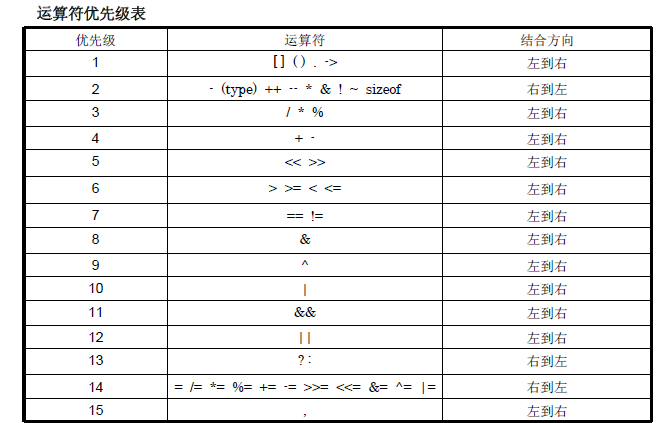  

####vim 进阶
  
  
  
[手把手教你把Vim改装成一个IDE编程环境(图文)](http://blog.csdn.net/wooin/article/details/1858917)  

