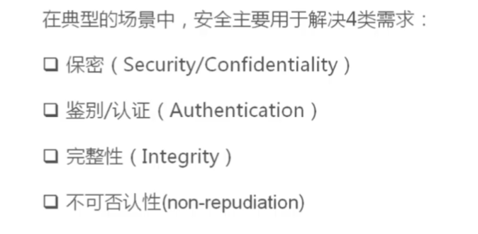
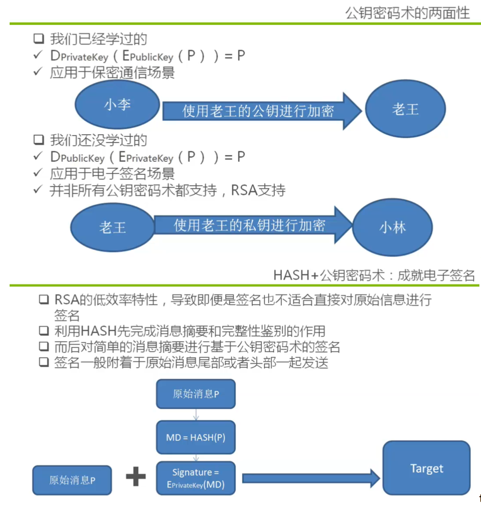
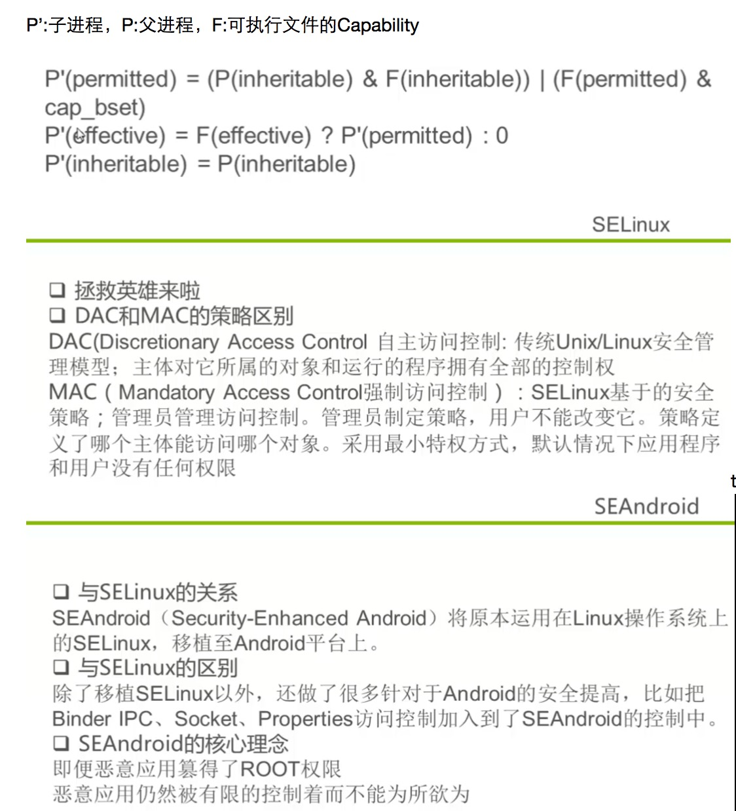
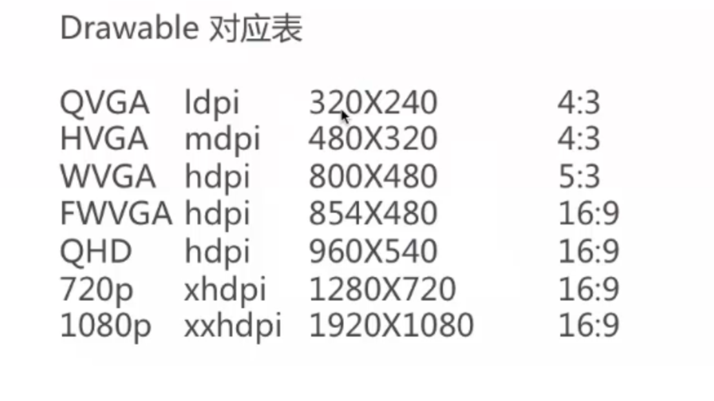
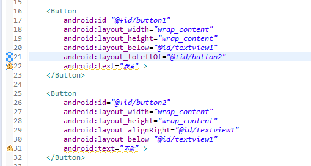

####安全篇
1. 概述  
  
2. 对称加密  
置换加密、转置加密、乘积加密  
DES/AES  
高效、密钥交换的问题、不如RSA加密的安全程度高，但256bit的AES足够绝大多数安全领域  
3. 非对称加密  
RSA  
安全性足够高、没有密钥交换的问题、效率低，对大数据加密很慢  
4. 密钥交换  
非对称加密方式交换密钥   
Diffi e-Hellman密钥交换协议  
5. HASH(哈希、散列、数字摘要、数字指纹、MD),变长输入变换成哼定长输出    
常见hash算法：MD5、SHA1    
易变性：即使原数据发生1bit的变化，hash的输出将发现不可预知的巨大变化  
不可逆：通过hash结果构造出输入信息是不可能的或者说极其困难  
应用场景：防篡改、防损坏、认证  
HMAC(Hash-based Message Authentication Code)，使用key对原始信息进行变换后再进行HASH。解决：1.尾部直接附带消息摘要的问题(篡改内容的同时篡改消息摘要)2.直接对密码做HASH传输的认证问题(重放攻击，不用破解，截获或直接使用。(预防重放攻击，还可以从server端先发送随机码，client段将密码和随机码拼接然后做HASH))。
6. 数字签名  
  
7. 证书  
可完成公钥的存储和交换

####Effective UID/ Real UID
Linux中，父子进程间UID的世袭原则：身份世袭二权利不世袭，及子进程可以继承Real UID,不能继承Effective UID。表现为子进程的Real UID=子进程的Effective UID=父进程的Real UID。  
典型的实例:passwd, 运行时候Effective UID被提升为root，但RUID不会变。su，EUID和RUID均会改变。
有了setuid 还有setgid及对应的Effective GID、Real GID。  
android_filesystem_capability.h中定义了capability的描述。
  
  

####FLAG_ACTIVITY_CLEAR_TOP
A,B,C,D依次启动了四个Activity，由D到B而且不再需要回到C，则可以在D中启动B的时候加入intent.setFlags(Intent.FLAG_ACTIVITY_CLEAR_TOP);  
引申：由D退出程序，则可以用如上方法启动A，同时配置A为android:launchMode="singleTop"，这时启动A就不会调用oncreate(),而是响应onNewIntent()，在A中重写onNewIntent()添加finish动作，这时将会退出整个程序。  
更多详情见：[ActivityGroup相关--getLocalActivityManager() 以及intent.setFlags(Intent.FLAG_ACTIVITY_CLEAR_TOP)用法](http://blog.csdn.net/getchance/article/details/8444589)

####定制控件几种方式
1. 继承其他空间类(EidtText、Button)
2. 组合方式。当前空间类从容器里继承，并将若干控件添加到当前的容器中
3. 绘制控件，也就是空间类从View继承，并从onDraw方法中从零绘制控件。
编写控件类的时应将可能变化的值通过属性设置，而不是直接固化在控件类中。

####getApplicationContext与this
对于一般的Android应用，通常有两种Context，即Activity和Application。  
getApplicationContext() 返回应用的上下文，生命周期是整个应用，应用摧毁它才摧毁。  
Activity.this 返回当前activity的上下文，生命周期只是它所在的Activity，activity 摧毁它就摧毁。
如果是在匿名内部类中，this通常就是不能用的，因为内部类所new出来的对象的生命周期比较短。  

####layout_gravity/gravity/padding/margin
layout_gravity：描述该view与父view间位置关系，即view的布局描述   
gravity：描述该view与其内容的位置关系，比如EditText/Button中的文字位置  
需要注意的是，垂直布局中，描述左右方向的位置描述生效，垂直方向比如top、bottom不生效；水平布局类推。  
padding：描述该view与其内容的距离关系  
margin：描述该view与邻居view的距离关系  

####layout_gravity/gravity/padding/margin
layout_gravity：描述该view与父view间位置关系，即view的布局描述  
gravity：描述该view与其内容的位置关系，比如EditText/Button中的文字位置  
需要注意的是，垂直布局中，描述左右方向的位置描述生效，垂直方向比如top、bottom不生效；水平布局类推。
padding：描述该view与其内容的距离关系  
margin：描述该view与邻居view的距离关系

####代码混淆
可以用sdk/tools下的混淆工具：proguard  
更方便的是在工程文件project.properties中打开这行的注释，使用默认的配置文件：proguard.config=${sdk.dir}/tools/proguard/proguard-android.txt:proguard-project.txt

####ZIP对齐对apk优化
签名之后进行此优化
	
	zipalign -v 4 src.apk dest.apk // -v像是详细输出，4字节对齐
	zipalgin -c -v 4 dest.apk   //-c检查对齐

####自动化测试工具：Monkey
monkey -p pkg_name  -v event_times

####性能分析工具：traceview
	Debug.startMethodTracing("activity_trace");
	test1();
	test2();
	Debug.stoipMethodTracing();
会在sd卡根目录生产一个activity_trace.trace文件，然后traceview  activity_trace.trace出现分析界面。

####内存消耗测试
long total = Runtime.getRuntime().totalMemory();//系统总内存
long free = Runtime.getRuntime().freeMemory(); //剩余内存

####ANR的处理思路
将耗资源的操作(比如下载文件，复杂计算)放到其他线程。

####Listview 的优化
1. 利用convertView，convertView相当于一个缓存，convertView会指向上下滑动list时候最近被遮挡的一个view。如果它不为空可直接拿这个view来使用，只需要重新更新相应的数据即可，而不需要重新new出一个view。
2. 定义一个ViewHolder类，存放需要findViewById查找的控件，然后使用setTag方法将ViewHolder对象与View绑定。在getView方法中convertView不为空的时候即可通过getTag方法重新得到view相应的控件，减少了消耗性能的findViewById操作的使用。
更多详情见：[Android ListView使用BaseAdapter与ListView的优化](http://www.open-open.com/lib/view/open1339485728006.html)

####组件所在进程
组件运行在哪个进程中可以在AndroidManifest中配置，其中Activity/Service/receiver/provider都有一个process属性来指定该组件运行所在进程。

####内存回收
针对像bitmap这样占用空间比较大的对象，如下方式提醒系统及时回收是个好习惯。

	if(bitmapObjec.isRecycled() == false){
		bitmapObject.recycle();
		system.gc();//提醒系统及时回收
	}

####屏幕适配
1. 涉及 屏幕尺寸、屏幕密度、屏幕方向、屏幕分辨率、独立于屏幕密度的像素(dp/sp)
2. 限制屏幕尺寸：在AndroidManifestxml中通过<compatible-screens>或者<supports-screens>标签来限制屏幕尺寸。在GooglePlay或者其他App市场上来过滤。
为不同的屏幕尺寸提供不同的布局：屏幕尺寸分为4个等级：small(标准120dpi-240*320)/normal(标准160dpi-320*480)/large(标准240dpi-480*800)/xlarge(320dpi-)，相应的布局资源目录layout-small/layout-normal/layout-large/layout-xlarge
3. 为不同的屏幕密度提供不同分辨率的图像资源（区分界限模糊）：低、中、高密度屏幕对应drawable-ldpi(版本不同可能是drawable)/drawable-mdpi/drawable-hdpi
4. 每一种屏幕尺寸都有要求的最小屏幕长宽尺寸，这些最小长宽尺寸使用与屏幕密度无关的单位dp，4种泛化的屏幕尺寸对应的最小屏幕长宽尺寸如下：  
xlarge: 960dp * 720 dp  
large: 640dp * 480dp  
normal: 470dp * 320dp  
small: 426dp * 320dp  
  

####有关数据库_id
Android对数据库表有一个约定，就是每张表都应该至少有_id这列。listview在适配cursor的时候，会默认的获取 _id 这列的值，如果建的表没有 _id这列的话，会报错。
如果不是用在listview中，创建表的时候可以不加 _id，但是查询的时候需要用as _id 。

####有关耗电
耗电状态切换时间：

1. 尽可能的将数据放在一起，减少建立链接的次数
2. 使用数据缓存机制，一般来说，每2到5分钟读取一次数据，每次1到5M是最佳选择；避免下载重复数据
3. 使用GCM(Google Cloud Messaging for Android)推送App的更新通知，这样不需要单独建立网络连接进行更新
4. 设置核实的轮询频率，最好允许用户修改轮询的频率
5. 使用HttpURLConnection 的Cache
6. 使用wifi，大多数情况下，wifi对电量的消耗要小于移动网络
7. 使用更高的带宽，使数据尽快下载或上传完，缩短耗电高枫的时间。ConnectivityManager.TYPE_WIFI/TYPE_MOBILE。

####硬件feature
android是默认设备带有触摸屏的，所以像在机顶盒、电视允许的系统中允许的话，就可以在AndroidManifest中配置不需要触摸屏：<uses-feature android:name="android.hardware.touchscreen" android:required="false">，运行时检测功能可用性可以用接口getPackageManager().hasSystemFeature("android.hardware.telephony")

####framelayout使用场景
framelayout 不需要调整的时候使用，效率比较高

####scrollview
scrollview 把原来layout中LinearLayout之类的字段替换成ScrollView，再将其中的内容用LinearLayout包裹一下即可

res中资源名字不能用数字打头，而且不能大写

####intent.setDataAndType
intent.setdata settype互斥，可以看下代码在设置一个的时候将另外一个置空了，所以需要两个都设置的时候调用intent.setDataAndType

####intent-filter
AndroidManifests.xml中给一个Activity指定的intent-filter可以有多个，intent-filter中的action、category、data也可以有多个。intent中设置的action只能有一个。

####eclipse创建android项目时，预览layout.xml文件时提示： This version of the rendering library is more recent than your version of ADT plug-in. Please update ADT plug-in，导致无法正常预览布局文件。
问题根源：SDK版本过高，ADT版本过低。可以调节预览页面右上角的android versiont to use when rendering layouts in eclipse，选择较低版本的api。如果不想每次手动调节这个东西，一则按照网上攻略选择help—>install new software升级tools(反正我是没有升级成功，翻墙状态下都根本刷不出来)，二则直接删掉较新的sdk，只留下document即可(删掉后出现了appcompat_v7报错的情况，删之，随便新建个工程即可附带重新生成)。

####用默认配置生成的工程会报错：R cannot be resolved to a variable
查看是没有R.java生成的，将appcompat_v7工程打开。将此工程关闭后采用默认配置生成的工程会立即出现报错。

####broadcast Reciever机制运行效率是比较低的，所以不能用于发送高频率或者发数据的场景。

使用bindService时候需要在service类中实现继承Binder的内部类，然后在onBind方法中返回该内部类的对象。否则在绑定service的时候没有onServiceConnected回调。

####startActivity方式打开音频、视频、图片、txt、word、网址、电话、短信、邮箱等等各种文件或组件

     实例：
     Uri uri = Uri.fromFile(new File("/mnt/sdcard/ice.avi")); 
     intent.setDataAndType (uri, "video/*"); 
     this.startActivity(intent);  

一个service只会有一个实例，多次绑定不会调用多次onCreate。service的整个生命周期有系统控制，所以不能通过new的方式来获取service的实例，需要通过bindService的形式获取。在一个activity中调用startService创建了服务，在该activity退出的时候服务不会被销毁；调用bindService创建的服务，在activity退出的时候服务会被销毁。

####Android推荐使用SparseArray代替HashMap，性能方面会有改善。

####LayoutInflater
LayoutInflater这个类的作用类似于findViewById(),  
不同点：   
LayoutInflater是用来找layout下xml布局文件的,而且它会实例化   
findViewById()是找具体xml布局文件下的具体widget控件，比如：Button按钮    

####Debug快捷键
F5 进入方法  
F6 逐行追踪  
F7 跳出方法  
F8 下一个断电或是结束Debug  

####Can't create handler inside thread that has not called Looper.prepare()   
子线程中handler需要跟looper一起使用

####android 中不允许图片资源的文件名中出现大写字母，且不能以数字开头。

####res\xml\oneXmlFile.xml: Invalid file name: must contain only [a-z0-9_.]

####mac下快捷键
comman+shift+f 格式化对齐  
command+Fn+F11 运行apk  
command+shift+o导包操作，推荐用这个，不仅可以导入需要的包，还能删掉多余的包  
command+alt+上/下  复制当前行到上面/下面  
alt+上/下   移动当前行到上面/下面  
command+alt+左/右 前一个/后一个编辑的页面  
command+Fn+F11 切换模拟器的横竖屏(genymotion也支持)  

####handler 负责发送消息，Looper负责接收handler发送的消息，并直接把消息回传给handler自己。

####(0202)am启动apk
am start -n [component] ,此处的component类似于代码里边的包名加类名，不过此处类名可以是完整的类名也可以是简写  
am start -n net.sunniwell.app.swsettings/.SWSettingsActivity  
am start -n net.sunniwell.app.swsettings/net.sunniwell.app.swsettings.SWSettingsActivity  

####有关@Override
@Override是伪代码,表示重写(当然不写也可以)，不过写上有如下好处:   
1、可以当注释用,方便阅读  
2、编译器可以给你验证@Override下面的方法名是否是你父类中所有的，如果没有则报错。例如，你如果没写@Override，而你下面的方法名又写错了，这时你的编译器是可以编译通过的，因为编译器以为这个方法是你的子类中自己增加的方法    

####eclipse快捷键
[动画讲解Eclipse常用快捷键](http://www.techug.com/eclipse-shortcut-keys)  

####15. layout 文件不能有大写字母，只能是a-z, 0-9, or _.  

####14. 有关不同类中方法重名
抛异常信息：java.lang.ClassCastException: android.view.ViewGroup$LayoutParams cannot be cast to android.widget.Gallery$LayoutParams
像imgview.setLayoutParams(new Gallery.LayoutParams(200, 150));
与 iv.setLayoutParams(new ImageSwitcher.LayoutParams(ImageSwitcher.LayoutParams.WRAP_CONTENT,ImageSwitcher.LayoutParams.WRAP_CONTENT));
根据报错找到LayoutParams使用位置，加上限定类。默认是属于ViewGroup

像button4.setOnClickListener(new View.OnClickListener() {
与builder.setPositiveButton("确定", new DialogInterface.OnClickListener() {

####13. testGallery  
attrs.xml 内容不能补全，怎么写出来的？

####12. 有关widget，TabHost/TabWidget/FrameLayout需要引用android中id中相应名称tabhost/tabs/tabcontent，要不然找不到tb或者tb.setup 抛空指针异常。
例如tabhost：不能用android:id="@+id/tabhost"，需要android:id="@android:id/tabhost"   
相应的Tabhost tb = (TabHost) findViewById(android.R.id.tabhost);  

####11. imageButton 点击时候会有整个方块颜色闪动，可以将背景设置为透明来解决此问题。

####10. 有关adapter创建时候制定adapter的选择模式是android自带layout中的一系列值，需要在R前加android限定  
ArrayAdapter<String> adapter = new ArrayAdapter<String>(this, android.R.layout.simple_list_item_single_choice, theItem);

####9. 有关快捷键
alt+s+f  文件格式化对齐  
ctrl+1    弹出报错信息，其中比较好用的是强制类型转换Add cast  
ctrl+/    添加注释及取消注释  
ctrl+e   打开的文件列表，切换文件  
ctrl+F11 运行apk  
ctrl+o 列出当前类中的方法列表  
ctrl+m 放大缩小当前窗口  
ctrl+PageDown/PageUp 切换选项卡，即切换不同文件  
crtl+shift+t 查找当前工程中的方法  
crtl+shift+r 查找当前工程中的文件  
ctrl+shift+o 导入包  

####8. 像RadioGroup/checkbox这样有相同名字listener方法的组件，在import方法的时候会冲突，这个时候在new listenser接口的时候在前面加上包名限定，如：  
          sex.setOnCheckedChangeListener(new RadioGroup.OnCheckedChangeListener() {

####7. @+id 新建一个资源id到R.java中，@id 引用一个资源id。如果引用一个在当前代码之后定义的资源的id，可以先在此新建。后续再@+id也没有影响。

####6. 创建工程时候指定的包名体现在androidManifest.xml中，在src中新建包名需要一致，否则发现AndroidManifest及gen下包名均是建工程时候起的包名。  
可以在AndroidManifest中更改，保存后会在gen下更新，如果出现多个包共存可以project--clean一下。  

####5. 不能在内部注释

####4. 填充接口中参数，极有可能包含在某个类中，具体哪个类，可以将鼠标停留在接口上然后从如下提示信息中查看：

####3. res-drawable 中图片名字不能数字打头  

####2. Didn't find class "*****Activity" on path: /data/app/*******.apk  
--更改包名后可以看到 *.java中package 引用报名自动改变了，下面引用的R路径没有改变，另外AndroidManifest.xml 中package 包名没有改变。这都需要手动改正过来。

####1. 运行时候弹框Your project contains error(s)，please fix them before running your application.  
具体报错：A resource exists with a different case  
--如下，报名包含了跟目录名相同的字段：BitmapShader1，修改包名后ok   

####0. 运行eclipse报错Fail to create the java Virtual Machine
见[解决Fail to create the java Virtual Machine_百度经验](http://jingyan.baidu.com/article/afd8f4de466baf34e286e917.html)

####adt/sdk/sudio下载地址
详情见[Android开发环境的官网下载地址](http://www.cnblogs.com/tc310/p/3938353.html)  

####linux下安装sdk
详情见[RedHat Linux下安装jdk-6u45-linux-x64.bin](http://www.linuxidc.com/Linux/2014-01/95202.htm)   

####WIN7下jdk安装及环境配置
[JDK安装与环境变量配置](http://jingyan.baidu.com/article/6dad5075d1dc40a123e36ea3.html)  

####eclipse sdk Manager更新问题  
由于墙的原因，基本就是无法更新，可以设置一下http代理，在Android sdk manager-->settings中配置http proxy:http://mirrors.neusoft.edu.cn 端口：80,并且选中【Force https://... sources to be fetched using http://...】  
更多详情见：[AndroidDevTools简介](http://www.androiddevtools.cn/)

