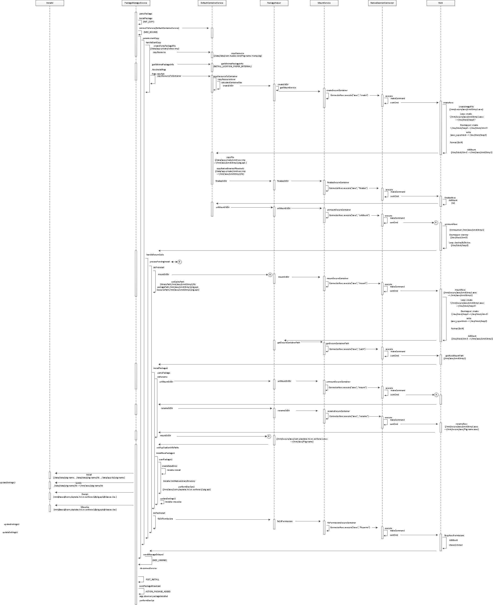

第1章  文档目的

本文以3719M平台为例，在Android4.2上研究apk的各种安装方式的流程，供决策及修改apk安装路径作为参考。

第2章  流程分析

Android中apk的安装大致分为如下四种方式：系统应用的安装、网络下载应用的安装、ADB工具安装、第三方安装应用安装。

2.1系统应用安装

此部分为开机阶段对已经存在的apk的安装。

大致流程为，系统启动后由SystemServer启动PackageManagerService，PMS在做完一些准备工作后调用scanDirLI接口依次对如下几个目录下进行扫描：/system/framework、/system/app、/vendor/app、/data/app、/data-app-private。代码见frameworks/base/services/java/com/android/server/pm/PackageManagerService.java

scanDirLI接口对目录进行完扫描得到apk文件后调用scanPackageLI接口来完成对apk包的解析和信息收集。其中比较关键的操作是调用parsePackage对AndroidManifest.xml文件及assets、res目录下众多文件进行解析和信息收集。 代码见frameworks/base/core/java/android/content/pm/PackageParser.java

安装流程见文档：apk安装之poweron.pdf，即下图：  
  

普通安装过程见文档：apk安装之common_apk_install.pdf，即下图：  
  

2.2 网络下载应用安装

现在看来从应用商城上下载安装的apk绝大部分是安装到了/data/app目录下，另外有一部分apk则通过制作镜像文件再映射到虚拟设备然后进行挂载的方式完成安装。

2.2.1 Devmapper方式安装

应用商城应用下载完apk后先调用parsePackage完成apk的完整性等校验工作，然后调用installPackage开始安装过程，此过程中可分为两大部分：

一：制作镜像过程

PendingInstalls创建一实例，先调用createTempPackageFile创建临时文件/data/app-private/vdlxxx.tmp，然后copyResource将下载的apk：/data/data/com.huawei.dsm/Pkg-name拷贝成上述临时文件。

调用getMinimalPackageInfo 获取到apk信息，主要有偏爱安装位置INSTALL_LOCATION_PREFER_EXTERNAL。

调用copyResourceToContainer过程中先通过createSdDir创建了镜像文件/mnt/secure/asec/smdl2tmp1.asec（一个指定大小的普通文件），然后创建/dev/block/loop0设备与此镜像文件关联，创建device-mapper设备：/dev/block/dm-0与此loop设备相关联，最后格式化成ext4文件系统后挂载到/mnt/asec/smdl2tmp1。

分区挂载准备好之后将临时文件/data/app-private/vdlxxx.tmp 拷贝为/mnt/asec/smdl2tmp1/pkg.apk并解压其中的lib到/mnt/asec/smdl2tmp1/lib中，然后调用finalizeSdDir将分区以只读权限重新挂载。这之后调用unMountSdDir将上述挂载分区卸载并将loop及dm设备destroy掉。

准备工作算是完成，下面开始安装过程。

二：安装过程

调用doPreinstall 重新查找到/mnt/secure/asec/smdl2tmp1.asec文件，然后完成映射及挂载，挂载点仍为/mnt/asec/smdl2tmp1。

installPackageLI中首先调用doRename将/mnt/secure/asec/smdl2tmp1.asec重命名为/mnt/secure/asec/Pkg-name.asec，并重新挂载为/mnt/asec/Pkg-name；然后检测是新安装的apk的话进入installNewPackageLI分支，通过installd创建/data/data/pkg-name/lib 链接到/mnt/asec/pkg-name/lib，生成相应的dex文件/data/dalvik-cache/mnt@asec@pkg-name@pkg.apk@classes.dex；最后调用fixSdPermissions设定/mnt/asec/pkg-name/下的目录和文件的权限后重新挂载为只读。

最后做一些收尾处理，如取消一些服务连接状态、发送安装完成广播、dex文件优化等

系统重启后此类apk依然能够安装的上，在scanAvailableAsecs扫描到之前创建好的镜像文件

安装流程见文档：apk安装之apk_install.pdf,即下图：  
  

开机过程中此类apk的安装过程相比较来看少了*.asec文件的创建动作，取而代之的是scanAvailableAsecs找到然后进行挂载。

2.2.2 普通方式安装

待补充

2.3 ADB工具安装

待补充

2.4 第三方安装应用安装

待补充

 

参考资料

部分参考内容及补充阅读：

Apk组成：[Android应用程序分析——apk的组成](http://blog.csdn.net/freshui/article/details/6440832)

Apk扫描：[Android应用程序包扫描过程源码分析](http://www.tuicool.com/articles/Vf2my2)

Apk安装：[Android应用程序安装过程源代码分析](http://blog.csdn.net/luoshengyang/article/details/6766010)

Loop：[loop 设备 (循环设备)](http://www.groad.net/bbs/thread-2352-1-1.html)

Dm-loop：[Linux 内核中的 Device Mapper 机制](http://www.ibm.com/developerworks/cn/linux/l-devmapper/index.html)

https://www.sourceware.org/lvm2/wiki/DMLoop

